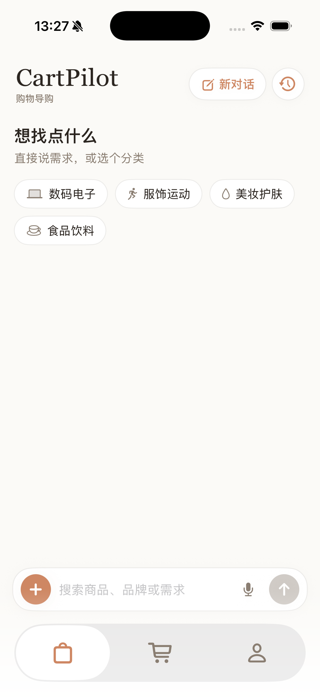
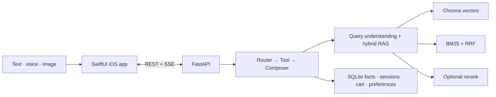

# CartPilot — Multimodal E-commerce AI Agent

[English](README.md) | [简体中文](README.zh-CN.md)

<p align="center">
  
  <a href="client/README.md"></a>
  <a href="#1-requirements"></a>
  <a href="https://github.com/YufanPeter/E-commerce-AI-Agent/stargazers"></a>
  <a href="https://github.com/YufanPeter/E-commerce-AI-Agent/issues"></a>
  
  <a href="LICENSE"></a>
</p>

<p align="center">
  
</p>

<h3 align="center">
  Bytedance Outstanding Project Award
</h3>

CartPilot is a conversational shopping assistant for iOS. Users can describe a need by text or voice, upload a product photo, refine recommendations across multiple turns, compare products, inspect details, and manage a persistent cart in one conversation.

The project uses a native SwiftUI client, a FastAPI backend, a controllable `router → tool → composer` agent, hybrid RAG retrieval, and SQLite-backed product facts.

## Demo

<p align="center">
  <a href="assets/demo_pic.png"></a>
</p>

<p align="center"><sub>CartPilot iOS app — start a shopping conversation with text, voice, or a product image.</sub></p>

## Core capabilities

- **Multimodal input:** text, Chinese speech recognition, camera, and photo library.
- **Conversational shopping:** recommendation, refinement, clarification, comparison, product detail, and cart operations.
- **Context and memory:** resolves references such as “the second one,” keeps session context, and stores undoable user preferences.
- **Hybrid retrieval:** structured filters + Chroma vector recall + BM25/RRF + optional reranking.
- **Negative constraints:** handles requests such as “sunscreen without alcohol” at the product level.
- **Grounded facts:** prices, SKUs, stock, and cart totals come from SQLite rather than generated text.

The included catalog contains 100 products and 585 SKUs across beauty, electronics, apparel, and food/lifestyle categories.

## Architecture



The LLM interprets intent and writes the response. Deterministic tools perform search, comparison, and cart mutations; SQLite remains the source of truth for product facts.

## Quick start

```bash
git clone https://github.com/YufanPeter/E-commerce-AI-Agent.git
cd E-commerce-AI-Agent
```

### 1. Requirements

- macOS with Xcode 15+ and an iOS 17+ simulator
- Python 3.10+; Python 3.11 or 3.12 is recommended
- Compatible model API credentials for the capabilities enabled below

### 2. Configure API keys

The project uses three model capabilities; it does not require a specific model name:

| Capability | Where it is used | Interface requirement |
| --- | --- | --- |
| General multimodal LLM | Intent routing, query understanding, response composition, and image-to-query understanding | OpenAI-compatible chat API with function calling and image input |
| Embedding model | Offline Chroma index construction, online text-query embedding, and image similarity | Text and image embeddings in the same vector space; compatible with the current multimodal embedding adapter |
| Reranking model (optional) | Reorders retrieved evidence chunks before product aggregation | Rerank API compatible with the current reranker response format |

The `ARK_*` and `ZHIPU_*` names are retained only for compatibility with the current code; they do not prescribe a model provider. Their values should point to your chosen compatible APIs.

Create `.env` in the repository root:

```dotenv
# General multimodal LLM API
ARK_API_KEY=your_model_api_key
ARK_MODEL=your_general_model_id
ARK_BASE_URL=https://your-model-api.example.com/v1

# Embedding API; its key falls back to ARK_API_KEY when omitted
ARK_EMBEDDING_API_KEY=your_embedding_api_key
ARK_EMBEDDING_MODEL=your_embedding_model_id
ARK_EMBEDDING_BASE_URL=https://your-embedding-api.example.com/v1

# Optional reranking API
ZHIPU_API_KEY=your_rerank_api_key
RERANK_MODEL=your_reranking_model_id
RERANK_BASE_URL=https://your-rerank-api.example.com/rerank

USE_HYBRID=1
USE_RERANK=1
```

To run without a reranking model, omit its three variables and set `USE_RERANK=0`.

### 3. Install and initialize data

A fresh clone must generate its local SQLite database and Chroma metadata once:

```bash
python3 -m venv .venv
source .venv/bin/activate
python -m pip install -r backend/requirements.txt

cd backend
python -m store.import_product_data --reset
python -m store.import_image_manifest
python -m rag.build_chroma --reset
cd ..
```

`rag.build_chroma` calls the embedding endpoint configured in `.env`.

### 4. Start the backend

```bash
./scripts/start_backend.sh
```

Confirm that it is ready:

```bash
curl http://127.0.0.1:8000/health
```

Expected response:

```json
{"status":"ok"}
```

For automatic reload during Python development, use `./scripts/dev.sh`.

### 5. Run the iOS app

```bash
open client/AIShoppingGuide.xcodeproj
```

In Xcode, open **Product → Scheme → Edit Scheme → Run → Arguments**. Set `BACKEND_BASE_URL` to `http://127.0.0.1:8000`, or disable that variable to use the simulator's localhost default.

Select an iPhone simulator, press **Run**, and try:

```text
推荐一款 500 元以内、不要含酒精的防晒
```

## Try the API directly

FastAPI documentation is available at `http://127.0.0.1:8000/docs`.

```bash
curl -N http://127.0.0.1:8000/chat/stream \
  -H 'Content-Type: application/json' \
  -d '{"query":"推荐 500 元以内的降噪耳机","user_id":"demo_user"}'
```

The stream emits session metadata, progress status, structured tool results, text tokens, optional preference updates, and a final `done` event.

## Project structure

```text
backend/
├── api/       # FastAPI routes and SSE
├── agent/     # Router, orchestrator, composer, and tools
├── search/    # Query understanding, filters, BM25/RRF, visual search
├── rag/       # Chroma retrieval, embeddings, reranker, index builders
├── store/     # SQLite product, cart, session, and preference stores
├── eval/      # Labeled quality evaluations
└── llm/       # Model API client adapters

client/AIShoppingGuide/
├── GuideView.swift
├── FrontendServices.swift
├── ProductDetailView.swift
├── ComparisonView.swift
├── CartView.swift
└── PreferenceView.swift

data/          # Product JSON and catalog images
scripts/       # Local start, stop, restart, and development helpers
```

## Verification

```bash
cd backend
../.venv/bin/python -m pytest -q
../.venv/bin/python -m eval.consistency_eval
```

More implementation details are available in [the system design document](docs/system-design.md), [backend/README.md](backend/README.md), and [client/README.md](client/README.md).

## License

Released under the [MIT License](LICENSE).
