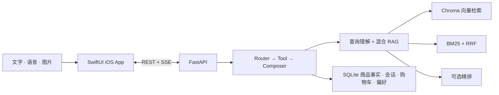

# CartPilot — 多模态电商智能导购 AI Agent

[English](README.md) | [简体中文](README.zh-CN.md)

<p align="center">
  
  <a href="client/README.zh-CN.md"></a>
  <a href="#1-环境要求"></a>
  <a href="https://github.com/YufanPeter/E-commerce-AI-Agent/stargazers"></a>
  <a href="https://github.com/YufanPeter/E-commerce-AI-Agent/issues"></a>
  
  <a href="LICENSE"></a>
</p>

<p align="center">
  
</p>

<h3 align="center">
  🏆 字节跳动优秀项目奖
</h3>

CartPilot 是一款面向 iOS 的对话式智能导购。用户可以通过文字、语音或商品图片表达需求，并在同一段对话中完成推荐、条件细化、商品对比、详情查询和购物车管理。

项目采用原生 SwiftUI 客户端、FastAPI 后端、可控的 `router → tool → composer` Agent、混合 RAG 检索与 SQLite 商品事实库。

## Demo

<p align="center">
  <a href="assets/demo_pic.png"></a>
</p>

<p align="center"><sub>CartPilot iOS App — 通过文字、语音或商品图片开启导购对话。</sub></p>

## 核心能力

- **多模态输入：** 支持文字、中文语音识别、相机拍摄和相册选图。
- **对话式导购：** 支持推荐、细化、澄清、对比、商品详情和购物车操作。
- **上下文与记忆：** 能理解“第二个”等指代，保存会话上下文，并记录可撤销的用户偏好。
- **混合检索：** 结构化过滤 + Chroma 向量召回 + BM25/RRF + 可选精排。
- **否定条件：** 在商品级处理“不要含酒精”等排他需求。
- **事实一致性：** 价格、SKU、库存和购物车总价来自 SQLite，不由大模型生成。

仓库内置 100 个商品和 585 个 SKU，覆盖美妆护肤、数码电子、服饰运动、食品生活四大类目。

## 系统架构



大模型负责理解意图和组织回答；检索、对比和购物车操作由确定性工具执行，SQLite 始终是商品事实的权威来源。

## 快速开始

```bash
git clone https://github.com/YufanPeter/E-commerce-AI-Agent.git
cd E-commerce-AI-Agent
```

### 1. 环境要求

- macOS、Xcode 15+、iOS 17+ 模拟器
- Python 3.10+，推荐 Python 3.11 或 3.12
- 下表所需能力对应的兼容模型 API 凭证

### 2. 配置 API Key

项目使用三类模型能力，但不限定具体模型名称：

| 能力 | 使用位置 | 接口要求 |
| --- | --- | --- |
| 通用多模态大模型 | 意图路由、查询理解、回答生成、图片转检索词 | 兼容 OpenAI Chat API，支持 function calling 和图片输入 |
| Embedding 模型 | 离线构建 Chroma 索引、在线查询向量化、图片相似度计算 | 文本与图片位于同一向量空间，并兼容当前多模态 embedding 适配器 |
| Reranking 模型（可选） | 在商品聚合前对召回的证据 chunk 重新排序 | 返回格式兼容当前 reranker 适配器 |

`ARK_*` 和 `ZHIPU_*` 只是为兼容当前代码而保留的变量名，并不限定模型厂商；变量值可以指向你选择的兼容 API。

在仓库根目录创建 `.env`：

```dotenv
# 通用多模态大模型 API
ARK_API_KEY=你的模型_API_Key
ARK_MODEL=你的通用模型_ID
ARK_BASE_URL=https://your-model-api.example.com/v1

# Embedding API；未设置独立 Key 时会回退复用 ARK_API_KEY
ARK_EMBEDDING_API_KEY=你的_embedding_API_Key
ARK_EMBEDDING_MODEL=你的_embedding_模型_ID
ARK_EMBEDDING_BASE_URL=https://your-embedding-api.example.com/v1

# 可选：Reranking API
ZHIPU_API_KEY=你的_reranking_API_Key
RERANK_MODEL=你的_reranking_模型_ID
RERANK_BASE_URL=https://your-rerank-api.example.com/rerank

USE_HYBRID=1
USE_RERANK=1
```

如果不使用 Reranking 模型，删除对应的三个变量，并设置 `USE_RERANK=0`。

### 3. 安装依赖并初始化数据

全新 clone 后需要生成一次本地 SQLite 数据库与 Chroma 元数据：

```bash
python3 -m venv .venv
source .venv/bin/activate
python -m pip install -r backend/requirements.txt

cd backend
python -m store.import_product_data --reset
python -m store.import_image_manifest
python -m rag.build_chroma --reset
cd ..
```

`rag.build_chroma` 会调用 `.env` 中配置的 embedding 接入点。

### 4. 启动后端

```bash
./scripts/start_backend.sh
```

检查服务是否正常：

```bash
curl http://127.0.0.1:8000/health
```

预期返回：

```json
{"status":"ok"}
```

开发时需要 Python 自动重载，可以使用 `./scripts/dev.sh`。

### 5. 运行 iOS App

```bash
open client/AIShoppingGuide.xcodeproj
```

在 Xcode 中打开 **Product → Scheme → Edit Scheme → Run → Arguments**，将 `BACKEND_BASE_URL` 设置为 `http://127.0.0.1:8000`；也可以取消勾选该变量，让模拟器使用默认 localhost。

选择一个 iPhone 模拟器，点击 **Run**，然后尝试：

```text
推荐一款 500 元以内、不要含酒精的防晒
```

## 直接调用 API

FastAPI 交互式文档位于 `http://127.0.0.1:8000/docs`。

```bash
curl -N http://127.0.0.1:8000/chat/stream \
  -H 'Content-Type: application/json' \
  -d '{"query":"推荐 500 元以内的降噪耳机","user_id":"demo_user"}'
```

SSE 会依次返回会话信息、执行进度、结构化工具结果、文本 token、可选偏好更新和最终 `done` 事件。

## 项目结构

```text
backend/
├── api/       # FastAPI 路由与 SSE
├── agent/     # Router、编排器、回答生成器与工具
├── search/    # 查询理解、过滤、BM25/RRF、视觉检索
├── rag/       # Chroma、embedding、reranker、索引构建
├── store/     # SQLite 商品、购物车、会话与偏好存储
├── eval/      # 标注质量评测
└── llm/       # 模型 API 客户端适配器

client/AIShoppingGuide/
├── GuideView.swift
├── FrontendServices.swift
├── ProductDetailView.swift
├── ComparisonView.swift
├── CartView.swift
└── PreferenceView.swift

data/          # 商品 JSON 与图片
scripts/       # 本地启动、停止、重启和开发脚本
```

## 验证

```bash
cd backend
../.venv/bin/python -m pytest -q
../.venv/bin/python -m eval.consistency_eval
```

更多实现细节见 [系统设计文档](docs/系统设计文档.md)、[backend/README.md](backend/README.md) 和 [客户端说明](client/README.zh-CN.md)。

## 开源协议

本项目基于 [MIT License](LICENSE) 开源。
