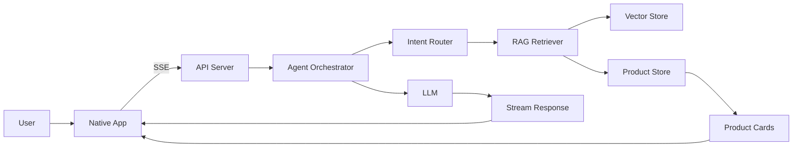

# PRD：基于 RAG 的多模态电商智能导购 AI Agent

## 1. 背景与定位

在短视频、直播和内容电商场景中，传统商品广告通常以图文、短视频或商品卡片为主，用户只能被动浏览。当用户产生模糊兴趣时，传统广告难以及时回答“适不适合我”“哪个更划算”“有没有更符合预算的选择”等长尾问题，转化链路容易在信息不充分处中断。

本项目希望通过 `AI Agent + RAG` 构建一个交互型电商导购助手，将“展示型广告”升级为“对话式导购”。用户可以用自然语言表达需求，Agent 基于商品库、SKU、营销描述、官方 FAQ 和用户评价进行检索、分析和推荐，帮助用户从浏览兴趣进入购买决策。

产品定位：

- 面向移动端原生 App 的电商智能导购 Demo。
- 以对话为主入口，以商品卡片为转化承接。
- 以 RAG 检索和结构化商品数据为事实来源。
- 优先完成端到端最小闭环，再增强多轮、反选、对比和多模态能力。

## 2. 输入材料

- 课题说明：`课题说明会：基于 RAG 的多模态电商智能导购 AI Agent.pdf`
- 样例数据集：`ecommerce_agent_dataset`
- 交互设计文档：`docs/交互流程与基础界面设计.md`
- 后端设计文档：`docs/后端业务技术选型与流程设计.md`

## 3. 基本决策

### 3.1 产品决策

- 对话页是核心入口，不做传统复杂商城首页。
- 商品推荐必须伴随推荐理由和风险提示。
- 商品卡片必须可点击，并能进入商品详情。
- 首期只做文本输入，多模态能力作为 Phase 4 加分项。
- 购物车首期不作为主闭环，Phase 4 可作为加分方向。

### 3.2 技术决策

- 客户端遵循课题要求，选择 iOS 或 Android 原生 App，不采用纯 Web/H5 作为最终交付。
- 后端推荐采用 `Python FastAPI`。
- 流式输出首期采用 `SSE`，后续多模态或实时双向场景可扩展到 WebSocket。
- 商品结构化事实由 Product Store 维护，价格、SKU、品牌、类目不得由模型自由生成。
- 非结构化知识通过 RAG 检索，包括营销描述、FAQ、用户评价。
- API Key、模型配置等敏感信息必须使用环境变量管理，不写入仓库文档或代码。

### 3.3 数据决策

当前样例数据集覆盖 4 个类目：

- 美妆护肤
- 数码电子
- 服饰运动
- 食品饮料

每个商品主要包含：

- 商品 ID、标题、品牌、类目、子类目、基础价格、图片路径。
- SKU 列表，包含规格属性和价格。
- `marketing_description`，用于卖点、适用人群、使用建议。
- `official_faq`，用于规格选择、成分/功能解释、使用注意事项。
- `user_reviews`，用于真实体验、优缺点和风险提示。

## 4. 产品目标

### 4.1 最小目标

完成一个可运行 Demo，跑通：

用户输入需求 -> 后端识别意图 -> RAG 检索商品 -> LLM 生成回复 -> 客户端流式渲染 -> 展示可点击商品卡片。

### 4.2 体验目标

- 用户能像问导购一样表达需求。
- Agent 能回答“推荐什么”“为什么推荐”“有什么风险”“哪个更适合我”。
- 商品卡片能承接购买决策，而不是只输出纯文本。
- 推荐结论可信，不编造不存在的商品事实。

### 4.3 评审目标

- 端到端链路完整。
- 原生客户端体验清晰。
- RAG 链路可解释。
- 复杂场景处理体现 Agent 能力。
- 至少一个加分方向做深，而不是多个方向浅尝。

## 5. 核心用户场景

### 5.1 单轮模糊推荐

用户输入：

- “推荐一款适合油皮的洗面奶。”
- “推荐一款熬夜后用的抗初老精华。”

Agent 能力：

- 识别类目、肤质、功效、适用人群。
- 检索商品描述、FAQ、用户评价。
- 返回推荐商品、推荐理由和注意事项。

### 5.2 条件筛选

用户输入：

- “200 元以内的蓝牙耳机有哪些？”
- “500 元以内轻量跑鞋推荐一下。”

Agent 能力：

- 抽取预算、类目、属性。
- 使用结构化价格和类目过滤。
- 对语义偏好做向量召回。
- 无结果时提示放宽条件，不编造商品。

### 5.3 多轮追问与细化

用户路径：

1. 用户：“帮我推荐跑鞋。”
2. Agent：“你更看重轻量、缓震、通勤还是训练？”
3. 用户：“要轻量的。”
4. Agent：“预算大概是多少？”
5. 用户：“500 以内。”

Agent 能力：

- 维护会话上下文。
- 逐步补全需求槽位。
- 基于历史条件继续检索。

### 5.4 对比决策

用户输入：

- “这两款面霜哪个更保湿？”
- “A 和 B 哪个更适合敏感肌？”

Agent 能力：

- 识别上下文中的商品指代。
- 对多个商品并行检索。
- 按价格、卖点、适用人群、用户评价、风险提示做结构化对比。
- 给出明确推荐结论。

### 5.5 反选和排除约束

用户输入：

- “推荐防晒霜，但不要含酒精，也不要日系品牌。”
- “除了耐克，还有什么跑鞋推荐？”

Agent 能力：

- 解析否定条件。
- 从候选集中排除冲突商品。
- 对无法确认的信息保持保守表达。

### 5.6 场景化组合推荐

用户输入：

- “下周去三亚度假，帮我搭配一套从防晒到穿搭的方案。”

Agent 能力：

- 理解出行场景。
- 跨类目检索。
- 组合推荐防晒、服饰、饮品等商品。

该能力建议 Phase 3 以后实现。

### 5.7 购物车与下单

用户输入：

- “把刚才那款加到购物车。”
- “删掉第二个。”
- “数量改成 2。”

Agent 能力：

- 将自然语言转换为购物车 CRUD 操作。
- 在客户端实时反馈购物车状态。

该能力作为 Phase 4 加分项，不作为首期必须能力。

## 6. 产品范围

### 6.1 Phase 1 范围：最小闭环

目标：

- 证明端到端导购链路可运行。

功能：

- 原生 App 对话页。
- 文本输入。
- AI 流式回复。
- 商品 RAG 检索。
- 商品卡片展示。
- 商品详情页。
- 单轮模糊推荐。
- 简单条件筛选。
- 检索为空、网络失败、模型超时等基础异常状态。

验收标准：

- 用户输入“推荐一款适合油皮的洗面奶”后，系统能返回库内商品。
- AI 回复为流式渲染。
- 回复中包含可点击商品卡片。
- 商品详情页展示商品基础信息和 SKU。
- 不编造库外商品、价格和优惠。

### 6.2 Phase 2 范围：导购增强

目标：

- 让 Agent 从一次性问答升级为多轮导购。

功能：

- 多轮上下文。
- 主动澄清。
- 偏好标签。
- 用户补充预算、用途、肤质、属性后继续推荐。
- “再便宜点”“换一个”“第二个”等基础指代处理。

验收标准：

- 用户无需重复上一轮条件。
- Agent 能主动询问关键缺失信息。
- 客户端能展示已识别偏好。

### 6.3 Phase 3 范围：决策辅助

目标：

- 帮助用户在多个候选商品之间做决策。

功能：

- 多商品对比。
- 反选和排除条件。
- FAQ 和用户评价摘要。
- 商品优缺点归纳。
- 场景化组合推荐。

验收标准：

- 支持“这两个哪个更适合我”的上下文对比。
- 支持“不要含酒精”“不要某品牌”等否定约束。
- 资料不足时能明确说明，不做绝对承诺。

### 6.4 Phase 4 范围：加分项方向

候选方向：

- 购物车闭环：对话式加购、删除、改数量、模拟下单。
- 多模态交互：语音输入、TTS 播报、拍照找货。
- 工程性能：热门查询缓存、首 token 优化、骨架屏和体验打磨。
- RAG 增强：query rewrite、rerank、证据引用、防幻觉校验、多商品对比增强。

推荐做精方向：

- 优先做“对话智能与 RAG 增强”。
- 重点包括多轮上下文、反选/排除、多商品对比、证据引用和防幻觉。
- 该方向最贴合现有数据集字段，也最能体现评审关注的 Agent 智能深度和 RAG 可靠性。

## 7. 核心架构

核心链路：

1. 用户在原生 App 输入需求。
2. API Server 接收请求并建立流式响应。
3. Agent Orchestrator 识别意图和参数。
4. Retriever 执行结构化过滤和向量召回。
5. Product Store 提供商品、SKU、价格等事实字段。
6. LLM 基于检索证据生成自然语言导购回复。
7. 后端通过 SSE 返回文本片段、商品卡片、追问建议和完成事件。
8. 客户端逐步渲染 AI 回复和商品卡片。

## 8. 关键页面

### 8.1 对话导购页

职责：

- 接收用户输入。
- 展示用户消息和 AI 流式回复。
- 展示商品卡片、对比卡片和澄清追问。
- 展示错误、空结果和重试状态。

### 8.2 商品详情页

职责：

- 展示商品主图、标题、品牌、类目、价格区间。
- 展示 SKU 列表。
- 展示营销描述、FAQ、用户评价摘要。
- 支持返回对话继续追问。

### 8.3 购物车页

职责：

- Phase 4 可选。
- 展示已加购商品、规格、数量、总价。
- 支持自然语言购物车操作的结果展示。

## 9. 数据与知识库设计

### 9.1 结构化数据

结构化字段包括：

- 商品 ID
- 商品标题
- 品牌
- 类目
- 子类目
- 价格
- 图片路径
- SKU 属性和 SKU 价格

这些字段必须由后端结构化存储维护，不能交给 LLM 自由生成。

### 9.2 非结构化知识

非结构化知识包括：

- 营销描述
- 官方 FAQ
- 用户评价

用途：

- 营销描述用于卖点、使用场景、适用人群。
- FAQ 用于成分、规格选择、使用注意事项。
- 用户评价用于优点、缺点、风险和真实体验。

### 9.3 防幻觉要求

- 商品推荐必须来自商品库。
- 商品卡片字段必须由后端组装。
- 价格、SKU、品牌、图片不得由模型编造。
- 数据集中没有库存、优惠券、物流等字段时，不得回答具体值。
- 资料未明确时，应回答“当前商品资料未明确”。

## 10. 指标与验收

### 10.1 基础验收

- App 可发送文本消息。
- 后端可完成 RAG 检索。
- AI 回复可流式展示。
- 商品卡片可展示并点击。
- 商品详情页可打开。
- 异常状态有明确反馈。

### 10.2 效果验收

- 单轮推荐能命中合理商品。
- 条件筛选结果符合预算和类目。
- 多轮上下文能保留用户偏好。
- 对比结论有依据。
- 反选条件不会推荐冲突商品。

### 10.3 可靠性验收

- 不编造库外商品。
- 不编造价格、库存、优惠。
- 模型超时有降级提示。
- 检索为空有放宽条件建议。
- Demo 路径可稳定复现。

## 11. 风险

### 11.1 数据覆盖不足

风险：

- 当前数据集规模有限，某些用户问题没有对应商品。

应对：

- Demo 问题选择数据覆盖范围内的场景。
- 无结果时明确提示并建议放宽条件。

### 11.2 模型幻觉

风险：

- LLM 可能编造商品、价格、优惠或功效。

应对：

- 使用 RAG 证据约束。
- 商品卡片由后端生成。
- Prompt 明确禁止编造。
- 输出前做事实校验。

### 11.3 端到端联调复杂

风险：

- 客户端、后端、模型和向量库任一环节失败都会影响 Demo。

应对：

- 先完成最小链路。
- 提供健康检查和调试接口。
- 提前固定 Demo 脚本。

## 12. 结论

本项目应优先完成“原生对话页 + 后端 RAG + 流式回复 + 商品卡片”的端到端闭环。Phase 1 保证基础链路稳定；Phase 2 增强多轮上下文和澄清；Phase 3 做深对比、反选和场景化推荐；Phase 4 建议聚焦“对话智能与 RAG 增强”，以更好体现 Agent 能力和 RAG 可靠性。

