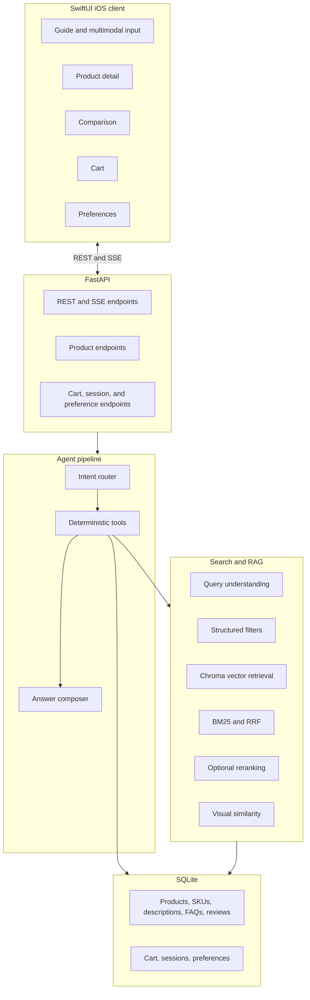
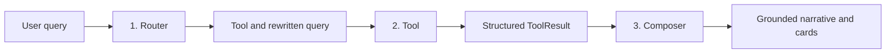
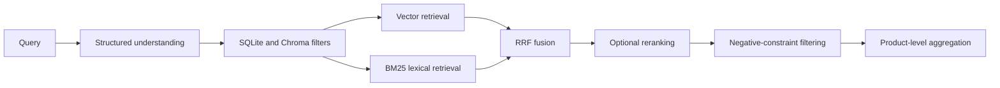

# CartPilot System Design

[English](system-design.md) | [简体中文](系统设计文档.md)

This document describes the architecture, runtime data flow, storage boundaries, and major design decisions behind CartPilot.

## 1. Goals

CartPilot turns product discovery into a conversational workflow. A user can express an imprecise need with text, voice, or an image and continue through recommendation, refinement, product detail, comparison, and cart operations.

The design follows three rules:

- Conversation is the primary interface; structured product cards support conversion.
- Deterministic product facts come from SQLite, never from generated prose.
- Retrieval keeps evidence so recommendations remain inspectable.

## 2. Architecture



### Technology boundaries

| Layer | Implementation | Responsibility |
| --- | --- | --- |
| Client | SwiftUI, iOS 17+ | UI state, streaming rendering, multimodal input, local transcripts |
| API | FastAPI | Validation, sessions, REST endpoints, and SSE event framing |
| Agent | `router → tool → composer` | Intent selection, deterministic execution, response generation |
| Retrieval | Chroma, BM25/RRF, optional reranker | Semantic recall, lexical recall, filtering, and evidence ranking |
| Facts | SQLite | Products, SKUs, prices, stock, carts, sessions, and preferences |
| Models | Compatible APIs | General multimodal LLM, embedding, and optional reranking capabilities |

No specific model name is required. The general model needs chat, function-calling, and image-input support; the embedding model serves indexing and query/image vectors; the optional reranker reorders retrieved evidence.

## 3. Agent pipeline

Every normal conversation turn follows a controlled three-stage pipeline:



The router selects one of these tools:

| Tool | Purpose |
| --- | --- |
| `recommend` | New product discovery and multi-request recommendation |
| `refine` | Add or replace constraints from the previous search |
| `compare` | Compare two or three resolved products |
| `product_detail` | Answer a question about one product using its evidence |
| `cart` | Add, remove, update, view, or check out cart items |
| `clarify` | Ask for missing information when a request is not searchable |
| `fallback` | Handle requests outside the shopping domain |

`ToolResult` separates execution from wording. Tools return structured payloads, optional composer guidance, or a deterministic narrative override. The composer never performs cart mutations or invents product facts.

### Context and references

The session stores recent messages plus structured working state:

- `last_parsed_query` supports refinements such as changing only the budget.
- `last_hits` supports ordinals such as “the second one.”
- `last_focus_product_id` supports pronoun and attribute follow-ups.
- Pending detail, comparison, or cart state lets a clarification continue on the next turn.

Deterministic ordinal and unique-name resolution runs first. An LLM-assisted match is used only for genuinely ambiguous candidates, with clarification as the safe fallback.

## 4. Retrieval pipeline



Query understanding produces category, subcategory, price, included and excluded brands, negative ingredients, soft terms, and a retrieval query. Structured constraints reduce the candidate set before semantic ranking. Product-level post-filters provide a second guard against prohibited brands, categories, or ingredients.

Chroma stores evidence chunks from marketing descriptions, official FAQs, and reviews. BM25 provides a lexical signal, and reciprocal-rank fusion combines lexical and vector rankings when hybrid retrieval is enabled. Reranking is optional and can be disabled with `USE_RERANK=0`.

### Visual search

The visual path converts an uploaded image into a search description with the multimodal LLM, merges optional user text, and reuses the normal retrieval pipeline. Image embeddings can then adjust the product ordering by visual similarity. If image understanding fails, the agent returns a clear fallback instead of guessing.

## 5. Data ownership

SQLite is the source of truth for fields that affect display or transactions:

| Table or view | Responsibility |
| --- | --- |
| `products` | Stable product identity, title, brand, category, and image metadata |
| `product_skus` | Variant properties, price, stock, and availability |
| `product_descriptions` | Marketing descriptions shared with RAG evidence |
| `product_faqs` | Official FAQ entries aligned by `product_id` and `source_index` |
| `product_reviews` | Review content, rating, and polarity |
| `cart_items` | Selected SKU, quantity, and transaction-price snapshot |
| `agent_sessions` | Persisted multi-turn session state |
| preference tables | Cross-session user preferences and undo history |
| `product_price_ranges` | Minimum and maximum active SKU prices for cards and filters |

Chroma is a retrieval index, not a fact database. Its metadata helps filtering and diagnosis, but final product cards and cart calculations are hydrated from SQLite.

## 6. API and streaming contract

The main endpoint is `POST /chat/stream`. A typical SSE sequence is:

```text
session → status → meta → status → tool_result → status? → token* → memory_update? → done
```

| Event | Client behavior |
| --- | --- |
| `session` | Persist the backend session ID for later turns |
| `status` | Show routing, retrieval, or generation progress |
| `meta` | Retain route and trace metadata for diagnosis |
| `tool_result` | Render products, comparisons, variants, or cart state immediately |
| `token` | Append streamed answer text |
| `memory_update` | Show an undoable preference update |
| `done` | Finalize the message with timings and the complete narrative |
| `error` | End the turn with a visible, recoverable error |

Other endpoints expose health, warmup, products, cart state, comparisons, preferences, sessions, conversation titles, and inventory-backed suggestions. FastAPI publishes their current schemas at `/docs`.

## 7. Client responsibilities

The SwiftUI client owns presentation state and complete local conversation transcripts. `FrontendServices.swift` maps backend SSE events into typed client events using incremental `URLSessionDataDelegate` parsing. Product IDs from compact agent results are hydrated through product endpoints before rendering.

The client restores the backend cart on launch, monitors `/health`, caches remote images, and stores conversations in `Documents/conversations.json`. User-visible Chinese copy remains in the UI because the current product experience targets Chinese shopping queries; implementation comments and public developer documentation are in English.

## 8. Failure handling

- Router failure falls back to the recommendation tool.
- Tool failure returns a safe fallback and records diagnostic trace data.
- Composer failure uses a local narrative while preserving structured tool results.
- Missing reranking configuration keeps vector or hybrid ordering.
- Missing visual understanding never fabricates a product match.
- Cart prices and stock are always re-read from SQLite.

These boundaries keep partial model or network failures from corrupting factual state.

## 9. Offline preparation and verification

A fresh environment builds its deterministic store and retrieval index before serving requests:

```bash
cd backend
python -m store.import_product_data --reset
python -m store.import_image_manifest
python -m rag.build_chroma --reset
```

The repository includes unit tests and labeled evaluations for retrieval, routing, negative filtering, reranking discrimination, and SQLite consistency:

```bash
cd backend
pytest -q
python -m eval.consistency_eval
```

The consistency evaluation is deterministic. Evaluations that exercise routing, embeddings, retrieval, or reranking require the corresponding API credentials.
