# 前端交互功能流程图（UML Diagram）

## 1. 文档说明

本文档基于 `docs/交互流程与基础界面设计.md` 生成，用于描述移动端前端的核心交互功能、页面跳转、状态流转和异常处理。

图示采用 Mermaid UML/流程图语法，适合放入 Markdown、技术方案、评审材料或前后端联调文档中。

## 2. 前端页面导航总览

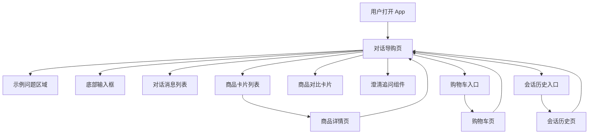
```mermaid
flowchart TD
  AppLaunch["用户打开 App"] --> ChatPage["对话导购页"]
  ChatPage --> DemoPrompts["示例问题区域"]
  ChatPage --> ChatInput["底部输入框"]
  ChatPage --> MessageList["对话消息列表"]
  ChatPage --> ProductCardList["商品卡片列表"]
  ChatPage --> CompareCard["商品对比卡片"]
  ChatPage --> ClarifyPanel["澄清追问组件"]
  ProductCardList --> ProductDetailPage["商品详情页"]
  ProductDetailPage --> ChatPage
  ChatPage --> CartEntry["购物车入口"]
  CartEntry --> CartPage["购物车页"]
  CartPage --> ChatPage
  ChatPage --> HistoryEntry["会话历史入口"]
  HistoryEntry --> HistoryPage["会话历史页"]
  HistoryPage --> ChatPage
```

说明：

- `对话导购页` 是核心首页。
- `商品详情页` 是 Phase 1 建议具备页面。
- `购物车页`、`会话历史页` 可作为 Phase 4 或后续增强。

## 3. 首次进入 App 流程

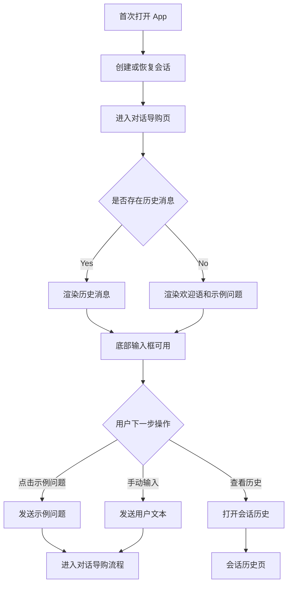
```mermaid
flowchart TD
  Start["首次打开 App"] --> InitSession["创建或恢复会话"]
  InitSession --> LoadChatPage["进入对话导购页"]
  LoadChatPage --> HasHistory{"是否存在历史消息"}
  HasHistory -->|Yes| RenderHistory["渲染历史消息"]
  HasHistory -->|No| RenderEmptyState["渲染欢迎语和示例问题"]
  RenderHistory --> ReadyInput["底部输入框可用"]
  RenderEmptyState --> ReadyInput
  ReadyInput --> UserAction{"用户下一步操作"}
  UserAction -->|点击示例问题| SendDemoPrompt["发送示例问题"]
  UserAction -->|手动输入| SendUserText["发送用户文本"]
  UserAction -->|查看历史| OpenHistory["打开会话历史"]
  SendDemoPrompt --> ChatFlow["进入对话导购流程"]
  SendUserText --> ChatFlow
  OpenHistory --> HistoryPage["会话历史页"]
```

前端要点：

- 首屏不能空白，需要展示欢迎语和示例问题。
- 示例问题与手动输入走同一套发送逻辑。
- 输入框应常驻底部并随键盘上移。

## 4. 文本提问与流式回复时序图

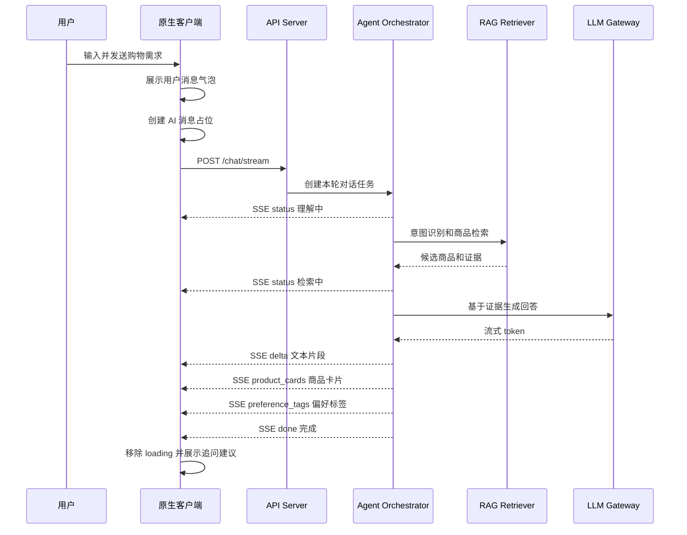
```mermaid
sequenceDiagram
  participant User as 用户
  participant App as 原生客户端
  participant Api as API Server
  participant Agent as Agent Orchestrator
  participant Rag as RAG Retriever
  participant LLM as LLM Gateway

  User->>App: 输入并发送购物需求
  App->>App: 展示用户消息气泡
  App->>App: 创建 AI 消息占位
  App->>Api: POST /chat/stream
  Api->>Agent: 创建本轮对话任务
  Agent-->>App: SSE status 理解中
  Agent->>Rag: 意图识别和商品检索
  Rag-->>Agent: 候选商品和证据
  Agent-->>App: SSE status 检索中
  Agent->>LLM: 基于证据生成回答
  LLM-->>Agent: 流式 token
  Agent-->>App: SSE delta 文本片段
  Agent-->>App: SSE product_cards 商品卡片
  Agent-->>App: SSE preference_tags 偏好标签
  Agent-->>App: SSE done 完成
  App->>App: 移除 loading 并展示追问建议
```

前端要点：

- 同一轮 AI 回复保持在一个 AI 消息块中。
- `delta` 事件追加文本，`product_cards` 事件插入卡片。
- `done` 事件后才展示最终追问建议。

## 5. AI 回复状态机

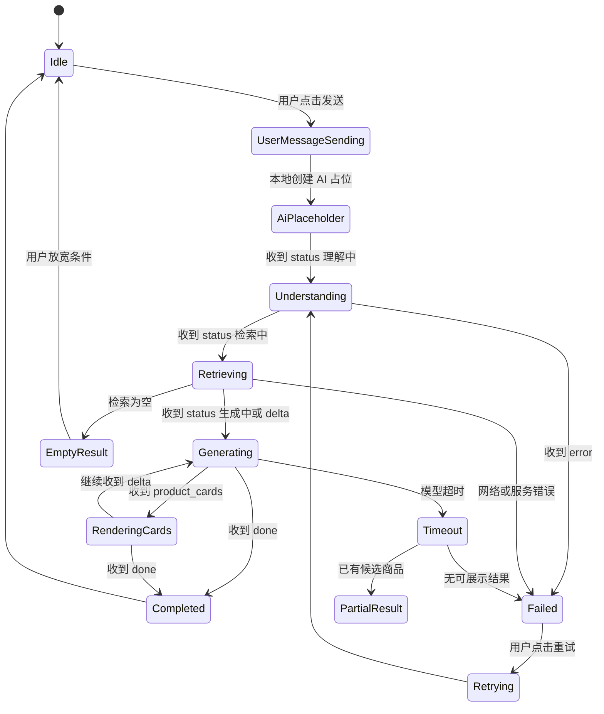
```mermaid
stateDiagram-v2
  [*] --> Idle
  Idle --> UserMessageSending: 用户点击发送
  UserMessageSending --> AiPlaceholder: 本地创建 AI 占位
  AiPlaceholder --> Understanding: 收到 status 理解中
  Understanding --> Retrieving: 收到 status 检索中
  Retrieving --> Generating: 收到 status 生成中或 delta
  Generating --> RenderingCards: 收到 product_cards
  RenderingCards --> Generating: 继续收到 delta
  Generating --> Completed: 收到 done
  RenderingCards --> Completed: 收到 done
  Understanding --> Failed: 收到 error
  Retrieving --> EmptyResult: 检索为空
  Retrieving --> Failed: 网络或服务错误
  Generating --> Timeout: 模型超时
  Timeout --> PartialResult: 已有候选商品
  Timeout --> Failed: 无可展示结果
  EmptyResult --> Idle: 用户放宽条件
  Failed --> Retrying: 用户点击重试
  Retrying --> Understanding
  Completed --> Idle
```

状态说明：

- `Idle`：可输入。
- `Understanding`：Agent 正在理解需求。
- `Retrieving`：后端正在查商品库。
- `Generating`：LLM 正在流式生成。
- `RenderingCards`：商品卡片已插入。
- `EmptyResult`：无匹配商品。
- `Timeout`：模型生成超时。
- `Failed`：网络、服务或流式中断。

## 6. 单轮推荐流程

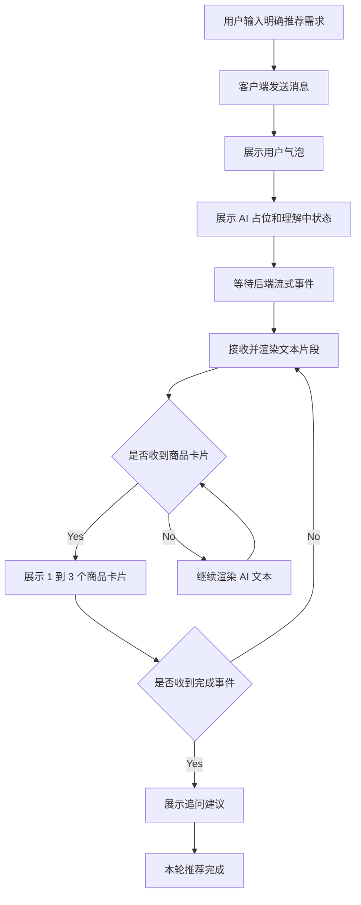
```mermaid
flowchart TD
  Start["用户输入明确推荐需求"] --> Send["客户端发送消息"]
  Send --> ShowUserBubble["展示用户气泡"]
  ShowUserBubble --> ShowAiLoading["展示 AI 占位和理解中状态"]
  ShowAiLoading --> WaitStatus["等待后端流式事件"]
  WaitStatus --> ReceiveDelta["接收并渲染文本片段"]
  ReceiveDelta --> HasCards{"是否收到商品卡片"}
  HasCards -->|Yes| RenderProductCards["展示 1 到 3 个商品卡片"]
  HasCards -->|No| ContinueText["继续渲染 AI 文本"]
  ContinueText --> HasCards
  RenderProductCards --> ReceiveDone{"是否收到完成事件"}
  ReceiveDone -->|No| ReceiveDelta
  ReceiveDone -->|Yes| RenderFollowUps["展示追问建议"]
  RenderFollowUps --> End["本轮推荐完成"]
```

前端验收：

- 用户发送后 300ms 内有可见反馈。
- 商品卡片展示标题、品牌、价格、SKU 摘要、推荐理由、风险提示。
- 推荐完成后展示下一步问题，例如“要更便宜一点吗？”。

## 7. 条件筛选流程

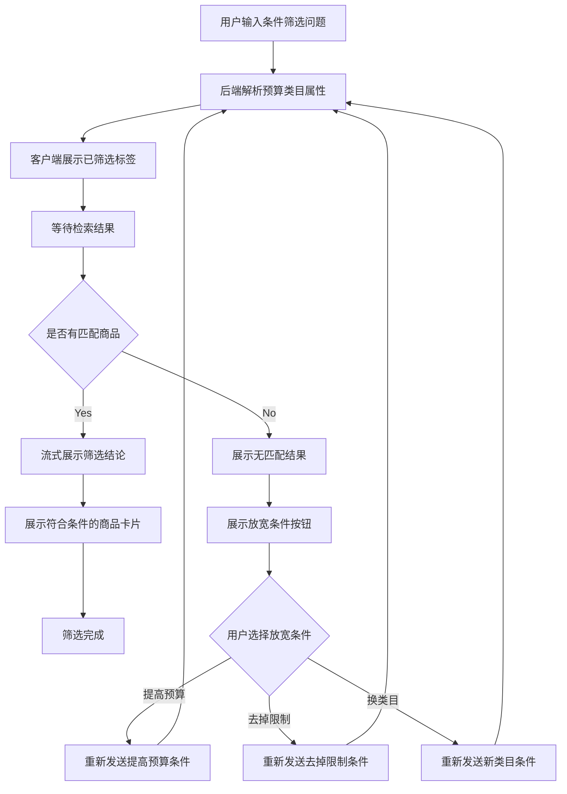
```mermaid
flowchart TD
  Start["用户输入条件筛选问题"] --> ParseByBackend["后端解析预算类目属性"]
  ParseByBackend --> ShowFilterTags["客户端展示已筛选标签"]
  ShowFilterTags --> WaitResult["等待检索结果"]
  WaitResult --> HasMatched{"是否有匹配商品"}
  HasMatched -->|Yes| RenderAnswer["流式展示筛选结论"]
  RenderAnswer --> RenderCards["展示符合条件的商品卡片"]
  RenderCards --> End["筛选完成"]
  HasMatched -->|No| RenderEmpty["展示无匹配结果"]
  RenderEmpty --> RelaxActions["展示放宽条件按钮"]
  RelaxActions --> UserRelax{"用户选择放宽条件"}
  UserRelax -->|提高预算| ResendWithBudget["重新发送提高预算条件"]
  UserRelax -->|去掉限制| ResendWithoutFilter["重新发送去掉限制条件"]
  UserRelax -->|换类目| ResendCategory["重新发送新类目条件"]
  ResendWithBudget --> ParseByBackend
  ResendWithoutFilter --> ParseByBackend
  ResendCategory --> ParseByBackend
```

前端要点：

- 价格和筛选标签需要和后端解析结果一致。
- 无结果时提供可点击的放宽条件动作。
- 不能展示“猜你喜欢”式无依据推荐。

## 8. 多轮追问收敛流程

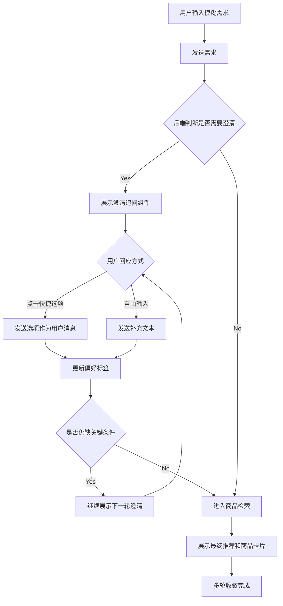
```mermaid
flowchart TD
  Start["用户输入模糊需求"] --> SendNeed["发送需求"]
  SendNeed --> NeedClarify{"后端判断是否需要澄清"}
  NeedClarify -->|Yes| RenderClarify["展示澄清追问组件"]
  RenderClarify --> UserChoice{"用户回应方式"}
  UserChoice -->|点击快捷选项| SendOption["发送选项作为用户消息"]
  UserChoice -->|自由输入| SendText["发送补充文本"]
  SendOption --> UpdateTags["更新偏好标签"]
  SendText --> UpdateTags
  UpdateTags --> NeedMore{"是否仍缺关键条件"}
  NeedMore -->|Yes| RenderNextClarify["继续展示下一轮澄清"]
  RenderNextClarify --> UserChoice
  NeedMore -->|No| RetrieveProducts["进入商品检索"]
  NeedClarify -->|No| RetrieveProducts
  RetrieveProducts --> RenderRecommendation["展示最终推荐和商品卡片"]
  RenderRecommendation --> End["多轮收敛完成"]
```

前端要点：

- 澄清选项点击后应变成一条用户消息。
- 偏好标签用于展示已识别上下文，例如“轻量”“500 元以内”。
- 用户可以跳过选项，直接自由输入。

## 9. 主动澄清组件流程

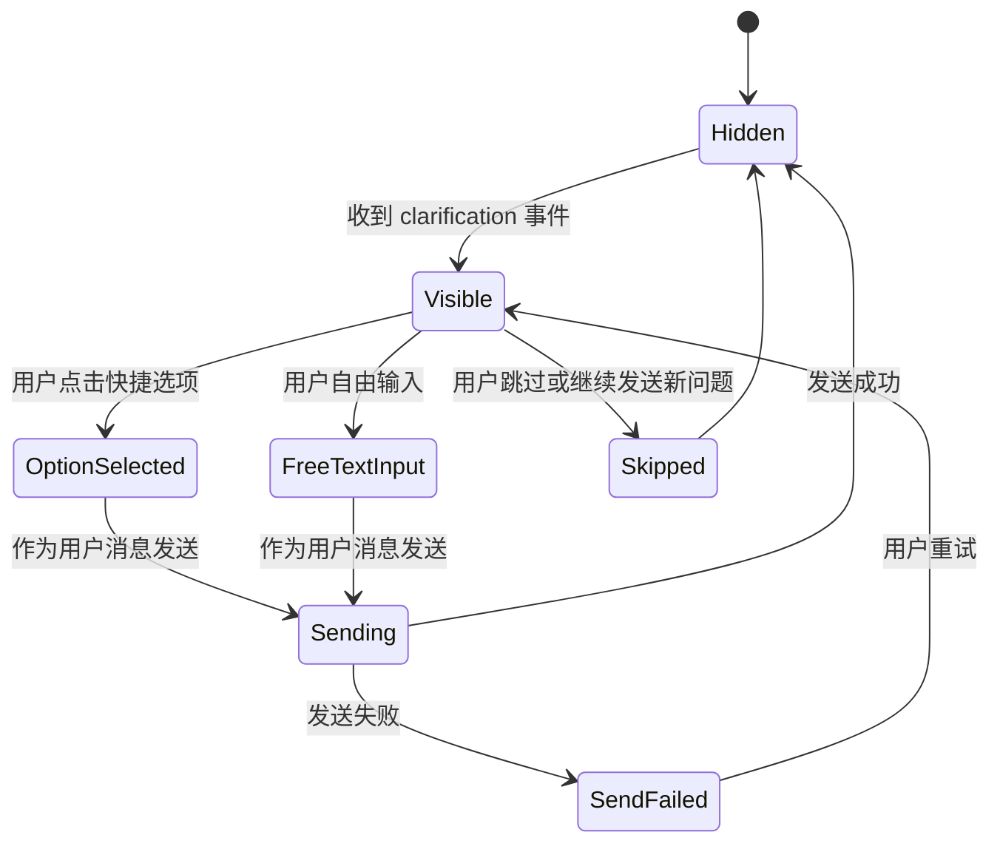
```mermaid
stateDiagram-v2
  [*] --> Hidden
  Hidden --> Visible: 收到 clarification 事件
  Visible --> OptionSelected: 用户点击快捷选项
  Visible --> FreeTextInput: 用户自由输入
  Visible --> Skipped: 用户跳过或继续发送新问题
  OptionSelected --> Sending: 作为用户消息发送
  FreeTextInput --> Sending: 作为用户消息发送
  Sending --> Hidden: 发送成功
  Sending --> SendFailed: 发送失败
  SendFailed --> Visible: 用户重试
  Skipped --> Hidden
```

组件字段：

- 澄清问题文案。
- 3 到 4 个快捷选项。
- 自由输入入口。
- 可选跳过入口。

## 10. 商品对比流程

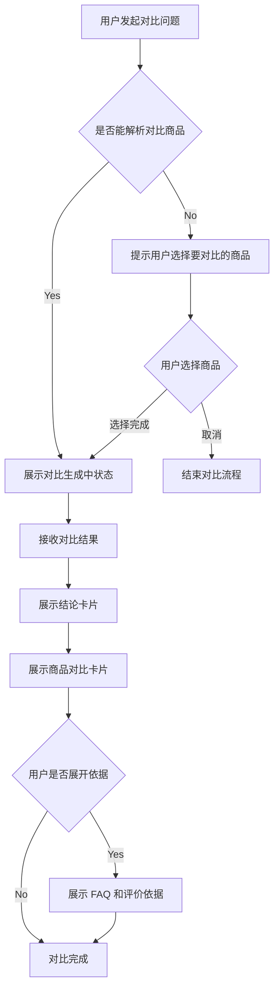
```mermaid
flowchart TD
  Start["用户发起对比问题"] --> HasContext{"是否能解析对比商品"}
  HasContext -->|Yes| ShowCompareLoading["展示对比生成中状态"]
  ShowCompareLoading --> ReceiveCompare["接收对比结果"]
  ReceiveCompare --> RenderSummary["展示结论卡片"]
  RenderSummary --> RenderCompareCard["展示商品对比卡片"]
  RenderCompareCard --> UserExpand{"用户是否展开依据"}
  UserExpand -->|Yes| ShowEvidence["展示 FAQ 和评价依据"]
  UserExpand -->|No| End["对比完成"]
  ShowEvidence --> End
  HasContext -->|No| AskSelectProducts["提示用户选择要对比的商品"]
  AskSelectProducts --> UserSelect{"用户选择商品"}
  UserSelect -->|选择完成| ShowCompareLoading
  UserSelect -->|取消| EndNoCompare["结束对比流程"]
```

对比卡片应包含：

- 价格。
- 适用人群。
- 核心卖点。
- 风险提醒。
- 用户评价倾向。
- SKU 选择复杂度。
- 推荐结论。

## 11. 反选与排除约束流程

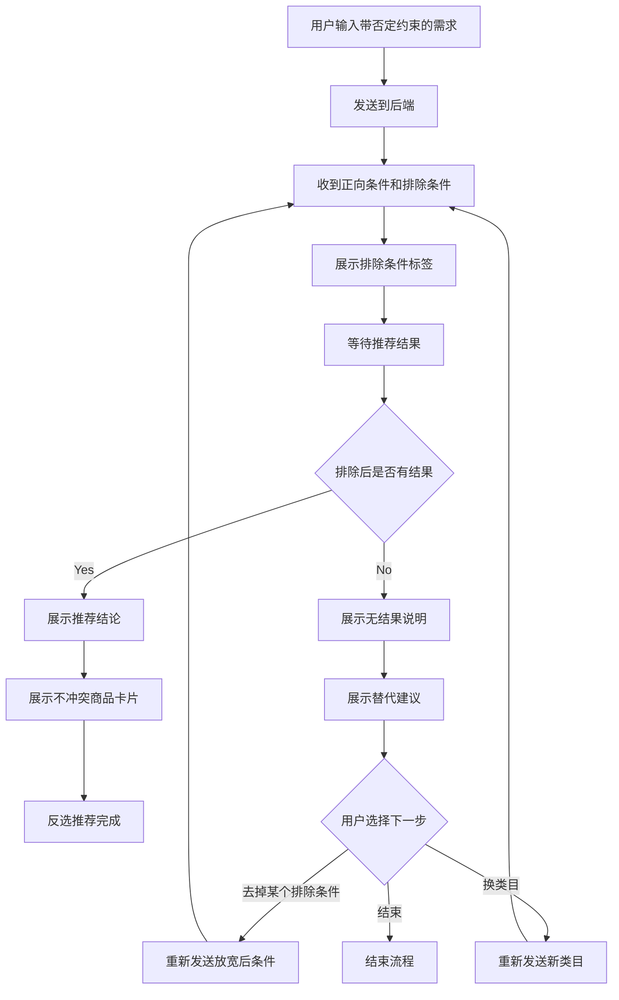
```mermaid
flowchart TD
  Start["用户输入带否定约束的需求"] --> Send["发送到后端"]
  Send --> ReceiveTags["收到正向条件和排除条件"]
  ReceiveTags --> RenderExcludeTags["展示排除条件标签"]
  RenderExcludeTags --> WaitResult["等待推荐结果"]
  WaitResult --> HasResult{"排除后是否有结果"}
  HasResult -->|Yes| RenderAnswer["展示推荐结论"]
  RenderAnswer --> RenderCards["展示不冲突商品卡片"]
  RenderCards --> End["反选推荐完成"]
  HasResult -->|No| RenderNoResult["展示无结果说明"]
  RenderNoResult --> ShowAlternatives["展示替代建议"]
  ShowAlternatives --> UserAction{"用户选择下一步"}
  UserAction -->|去掉某个排除条件| ResendRelaxed["重新发送放宽后条件"]
  UserAction -->|换类目| ResendCategory["重新发送新类目"]
  UserAction -->|结束| EndNoResult["结束流程"]
  ResendRelaxed --> ReceiveTags
  ResendCategory --> ReceiveTags
```

前端要点：

- 明确展示“已排除”标签。
- 资料未明确时展示“不确定”或“资料未明确”。
- 不展示与排除条件明显冲突的商品卡片。

## 12. 商品卡片点击与详情页流程

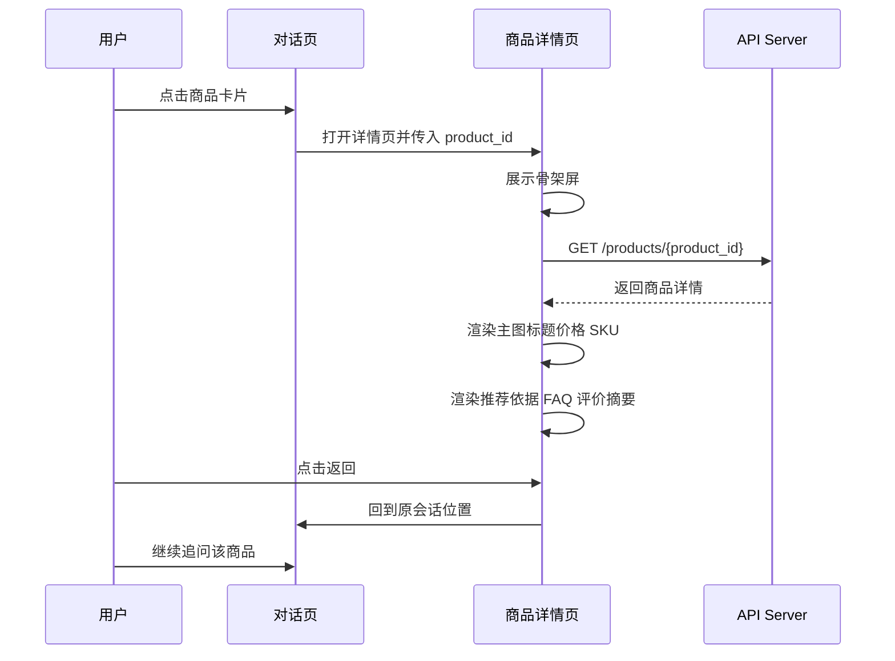
```mermaid
sequenceDiagram
  participant User as 用户
  participant Chat as 对话页
  participant Detail as 商品详情页
  participant Api as API Server

  User->>Chat: 点击商品卡片
  Chat->>Detail: 打开详情页并传入 product_id
  Detail->>Detail: 展示骨架屏
  Detail->>Api: GET /products/{product_id}
  Api-->>Detail: 返回商品详情
  Detail->>Detail: 渲染主图标题价格 SKU
  Detail->>Detail: 渲染推荐依据 FAQ 评价摘要
  User->>Detail: 点击返回
  Detail->>Chat: 回到原会话位置
  User->>Chat: 继续追问该商品
```

前端要点：

- 详情页加载失败时保留返回按钮。
- 返回对话页后保持原滚动位置。
- 继续追问时需要携带最近商品 ID 列表或当前商品 ID。

## 13. 商品详情页内部交互流程

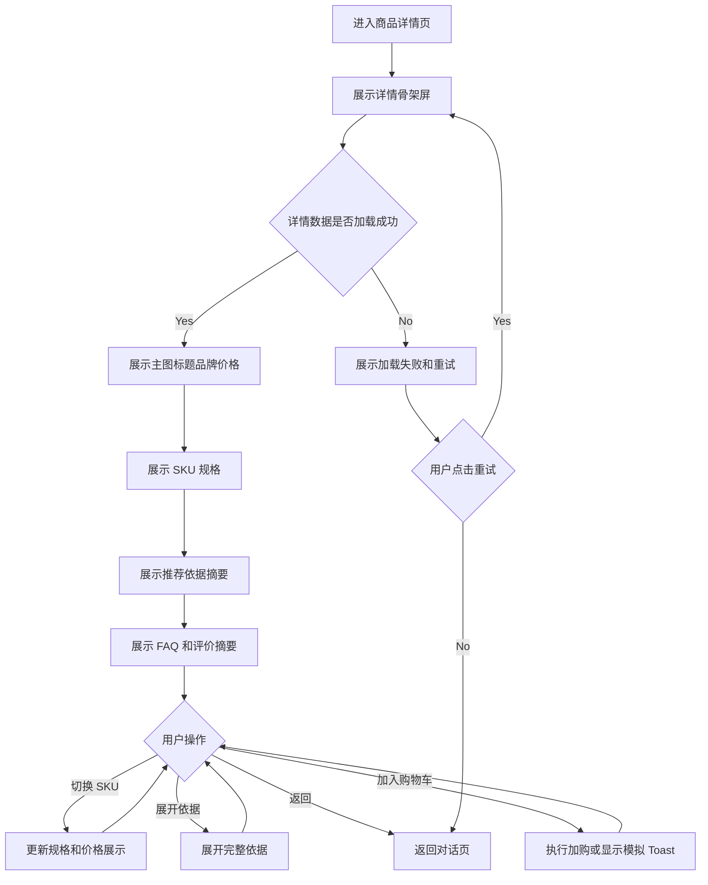
```mermaid
flowchart TD
  OpenDetail["进入商品详情页"] --> Loading["展示详情骨架屏"]
  Loading --> LoadResult{"详情数据是否加载成功"}
  LoadResult -->|Yes| RenderBasic["展示主图标题品牌价格"]
  RenderBasic --> RenderSku["展示 SKU 规格"]
  RenderSku --> RenderEvidence["展示推荐依据摘要"]
  RenderEvidence --> RenderFaqReviews["展示 FAQ 和评价摘要"]
  RenderFaqReviews --> UserAction{"用户操作"}
  UserAction -->|切换 SKU| UpdateSkuPrice["更新规格和价格展示"]
  UserAction -->|展开依据| ExpandEvidence["展开完整依据"]
  UserAction -->|返回| BackChat["返回对话页"]
  UserAction -->|加入购物车| AddCart["执行加购或显示模拟 Toast"]
  UpdateSkuPrice --> UserAction
  ExpandEvidence --> UserAction
  AddCart --> UserAction
  LoadResult -->|No| DetailError["展示加载失败和重试"]
  DetailError --> Retry{"用户点击重试"}
  Retry -->|Yes| Loading
  Retry -->|No| BackChat
```

## 14. 用户继续追问流程

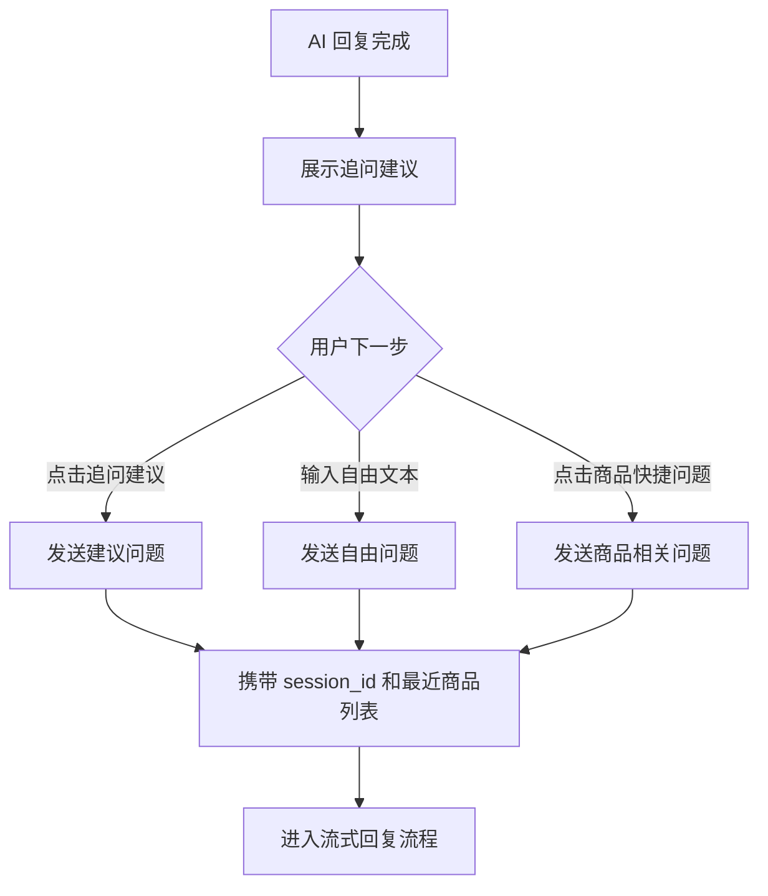
```mermaid
flowchart TD
  CompletedAnswer["AI 回复完成"] --> ShowFollowUps["展示追问建议"]
  ShowFollowUps --> UserNext{"用户下一步"}
  UserNext -->|点击追问建议| SendSuggested["发送建议问题"]
  UserNext -->|输入自由文本| SendFreeText["发送自由问题"]
  UserNext -->|点击商品快捷问题| SendProductQuestion["发送商品相关问题"]
  SendSuggested --> AttachContext["携带 session_id 和最近商品列表"]
  SendFreeText --> AttachContext
  SendProductQuestion --> AttachContext
  AttachContext --> StreamFlow["进入流式回复流程"]
```

前端需要携带：

- `session_id`
- 最近展示的 `product_id` 列表。
- 当前点击的商品 ID。
- 用户输入文本或快捷问题内容。

## 15. 错误处理总流程

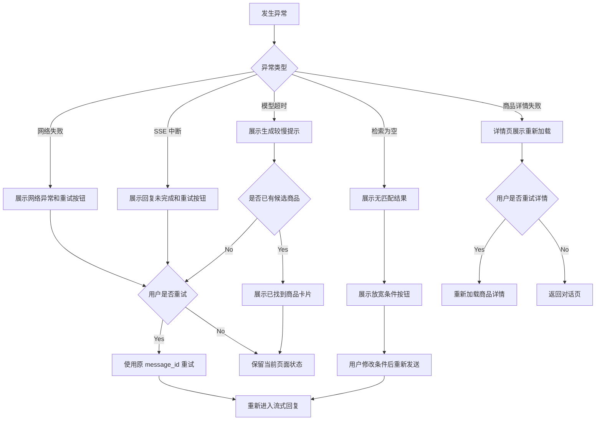
```mermaid
flowchart TD
  ErrorStart["发生异常"] --> ErrorType{"异常类型"}
  ErrorType -->|网络失败| NetworkError["展示网络异常和重试按钮"]
  ErrorType -->|SSE 中断| StreamError["展示回复未完成和重试按钮"]
  ErrorType -->|模型超时| TimeoutError["展示生成较慢提示"]
  ErrorType -->|检索为空| EmptyError["展示无匹配结果"]
  ErrorType -->|商品详情失败| DetailError["详情页展示重新加载"]
  NetworkError --> RetryMessage{"用户是否重试"}
  StreamError --> RetryMessage
  TimeoutError --> HasPartial{"是否已有候选商品"}
  HasPartial -->|Yes| ShowPartialCards["展示已找到商品卡片"]
  HasPartial -->|No| RetryMessage
  EmptyError --> ShowRelax["展示放宽条件按钮"]
  DetailError --> RetryDetail{"用户是否重试详情"}
  RetryMessage -->|Yes| ResendSameMessage["使用原 message_id 重试"]
  RetryMessage -->|No| KeepState["保留当前页面状态"]
  ShowPartialCards --> KeepState
  ShowRelax --> UserRelax["用户修改条件后重新发送"]
  RetryDetail -->|Yes| ReloadDetail["重新加载商品详情"]
  RetryDetail -->|No| BackToChat["返回对话页"]
  ResendSameMessage --> StreamFlow["重新进入流式回复"]
  UserRelax --> StreamFlow
```

前端原则：

- 不清空用户原始输入。
- 不清空已成功渲染的历史消息。
- 错误文案不能直接暴露技术错误码。
- 重试同一条消息时使用原 `message_id`。

## 16. 检索为空与放宽条件流程

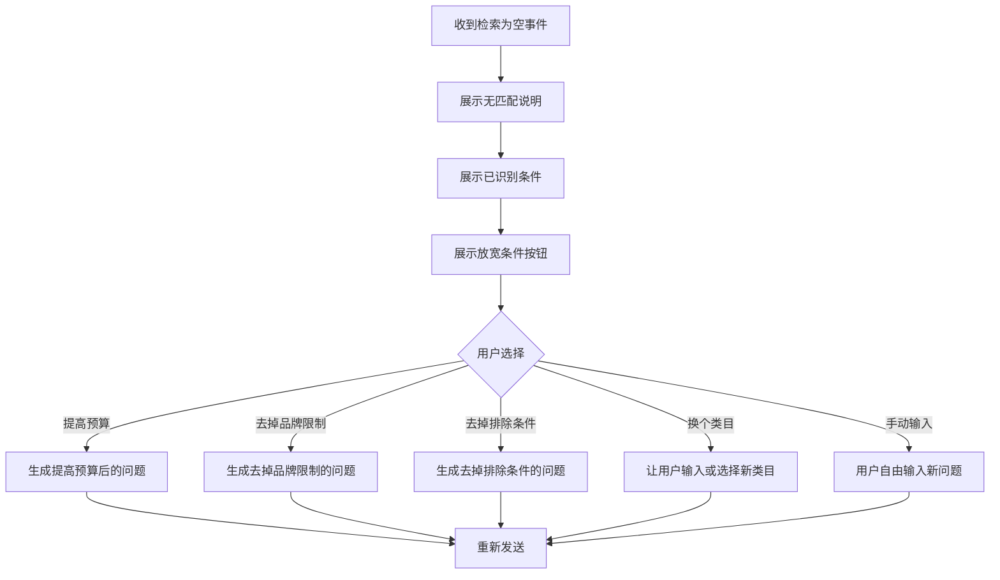
```mermaid
flowchart TD
  NoResult["收到检索为空事件"] --> RenderNoResult["展示无匹配说明"]
  RenderNoResult --> RenderConditionSummary["展示已识别条件"]
  RenderConditionSummary --> RenderRelaxButtons["展示放宽条件按钮"]
  RenderRelaxButtons --> RelaxChoice{"用户选择"}
  RelaxChoice -->|提高预算| UpdateBudget["生成提高预算后的问题"]
  RelaxChoice -->|去掉品牌限制| RemoveBrand["生成去掉品牌限制的问题"]
  RelaxChoice -->|去掉排除条件| RemoveExclude["生成去掉排除条件的问题"]
  RelaxChoice -->|换个类目| ChangeCategory["让用户输入或选择新类目"]
  RelaxChoice -->|手动输入| ManualInput["用户自由输入新问题"]
  UpdateBudget --> SendAgain["重新发送"]
  RemoveBrand --> SendAgain
  RemoveExclude --> SendAgain
  ChangeCategory --> SendAgain
  ManualInput --> SendAgain
```

## 17. 商品卡片展示决策流程

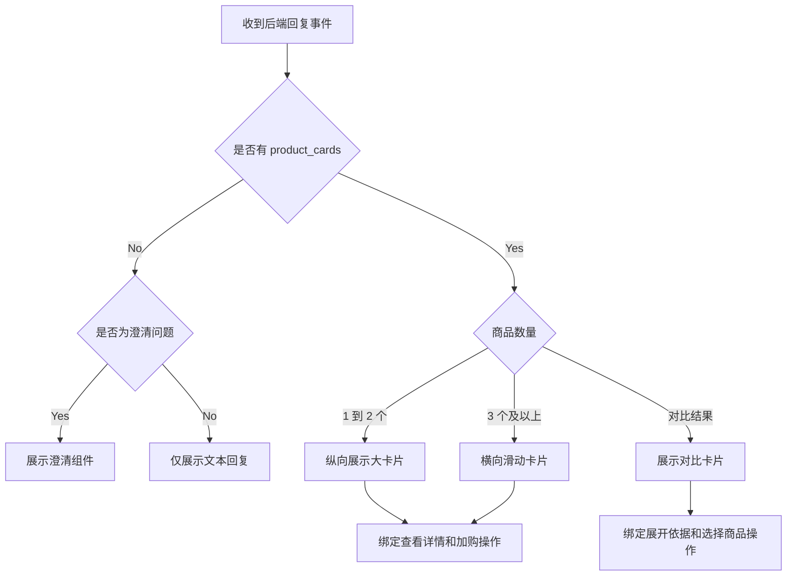
```mermaid
flowchart TD
  ReceiveAnswer["收到后端回复事件"] --> HasProductCards{"是否有 product_cards"}
  HasProductCards -->|No| IsClarification{"是否为澄清问题"}
  IsClarification -->|Yes| ShowClarify["展示澄清组件"]
  IsClarification -->|No| TextOnly["仅展示文本回复"]
  HasProductCards -->|Yes| CountCards{"商品数量"}
  CountCards -->|1 到 2 个| VerticalCards["纵向展示大卡片"]
  CountCards -->|3 个及以上| HorizontalCards["横向滑动卡片"]
  CountCards -->|对比结果| CompareCards["展示对比卡片"]
  VerticalCards --> BindActions["绑定查看详情和加购操作"]
  HorizontalCards --> BindActions
  CompareCards --> BindCompareActions["绑定展开依据和选择商品操作"]
```

## 18. 商品卡片组件状态机

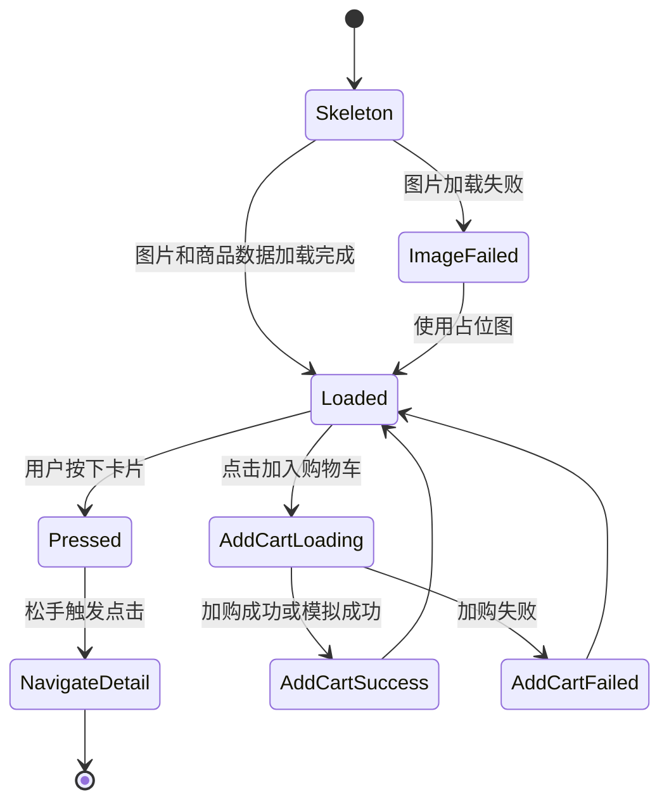
```mermaid
stateDiagram-v2
  [*] --> Skeleton
  Skeleton --> Loaded: 图片和商品数据加载完成
  Skeleton --> ImageFailed: 图片加载失败
  ImageFailed --> Loaded: 使用占位图
  Loaded --> Pressed: 用户按下卡片
  Pressed --> NavigateDetail: 松手触发点击
  Loaded --> AddCartLoading: 点击加入购物车
  AddCartLoading --> AddCartSuccess: 加购成功或模拟成功
  AddCartLoading --> AddCartFailed: 加购失败
  AddCartSuccess --> Loaded
  AddCartFailed --> Loaded
  NavigateDetail --> [*]
```

## 19. Demo 路径总流程

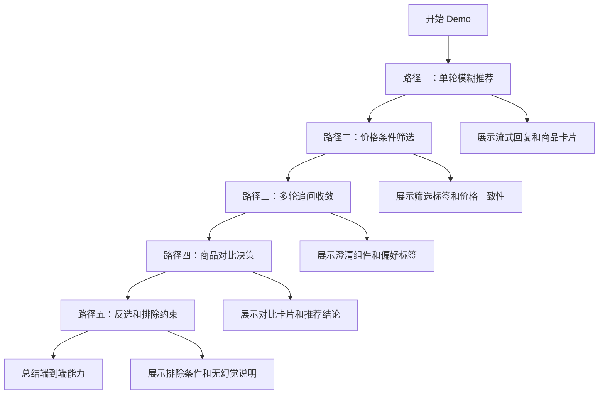
```mermaid
flowchart TD
  DemoStart["开始 Demo"] --> BasicDemo["路径一：单轮模糊推荐"]
  BasicDemo --> FilterDemo["路径二：价格条件筛选"]
  FilterDemo --> MultiTurnDemo["路径三：多轮追问收敛"]
  MultiTurnDemo --> CompareDemo["路径四：商品对比决策"]
  CompareDemo --> ExcludeDemo["路径五：反选和排除约束"]
  ExcludeDemo --> Summary["总结端到端能力"]

  BasicDemo --> BasicCheck["展示流式回复和商品卡片"]
  FilterDemo --> FilterCheck["展示筛选标签和价格一致性"]
  MultiTurnDemo --> MultiTurnCheck["展示澄清组件和偏好标签"]
  CompareDemo --> CompareCheck["展示对比卡片和推荐结论"]
  ExcludeDemo --> ExcludeCheck["展示排除条件和无幻觉说明"]
```

## 20. Phase 1 前端最小闭环流程

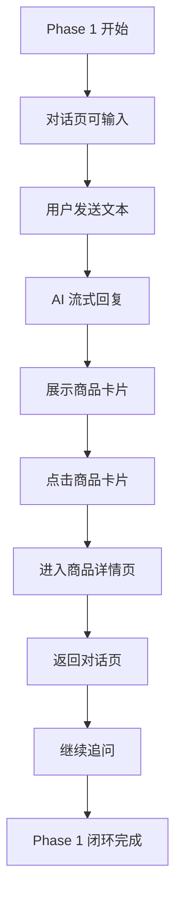
```mermaid
flowchart TD
  Start["Phase 1 开始"] --> ChatReady["对话页可输入"]
  ChatReady --> SendText["用户发送文本"]
  SendText --> StreamReply["AI 流式回复"]
  StreamReply --> RenderCard["展示商品卡片"]
  RenderCard --> ClickCard["点击商品卡片"]
  ClickCard --> DetailPage["进入商品详情页"]
  DetailPage --> BackChat["返回对话页"]
  BackChat --> ContinueAsk["继续追问"]
  ContinueAsk --> End["Phase 1 闭环完成"]
```

Phase 1 必须覆盖：

- 首次进入空状态。
- 文本输入和发送。
- AI 理解中、检索中、生成中、完成、失败状态。
- 商品卡片展示。
- 商品详情页。
- 网络失败重试。
- 检索为空提示。

## 21. Phase 2 前端增强流程

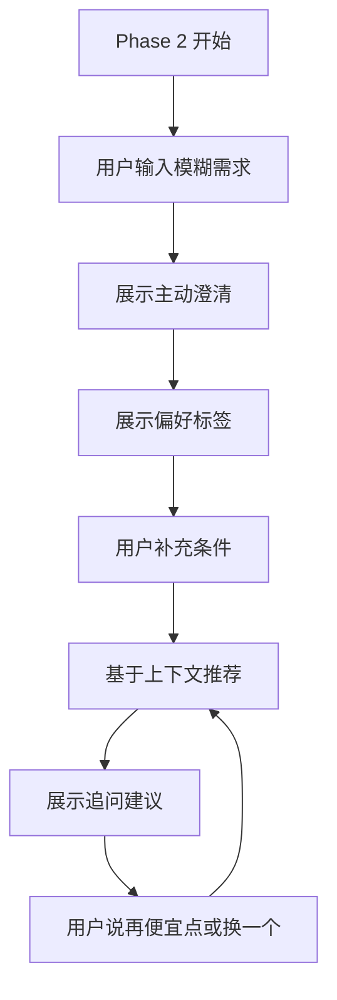
```mermaid
flowchart TD
  Start["Phase 2 开始"] --> UserVague["用户输入模糊需求"]
  UserVague --> Clarify["展示主动澄清"]
  Clarify --> PreferenceTags["展示偏好标签"]
  PreferenceTags --> UserRefine["用户补充条件"]
  UserRefine --> ContextAwareReply["基于上下文推荐"]
  ContextAwareReply --> FollowUp["展示追问建议"]
  FollowUp --> UserMore["用户说再便宜点或换一个"]
  UserMore --> ContextAwareReply
```

Phase 2 重点：

- 澄清追问组件。
- 偏好标签。
- 上下文追问。
- 指代型表达的前端上下文传递。

## 22. Phase 3 前端决策辅助流程

```mermaid
flowchart TD
  Start["Phase 3 开始"] --> UserDecision["用户进入决策阶段"]
  UserDecision --> CompareOrExclude{"用户需求类型"}
  CompareOrExclude -->|商品对比| CompareFlow["展示对比卡片"]
  CompareOrExclude -->|排除条件| ExcludeFlow["展示排除标签和推荐结果"]
  CompareOrExclude -->|场景组合| BundleFlow["按场景分组展示商品"]
  CompareFlow --> Evidence["支持展开推荐依据"]
  ExcludeFlow --> Evidence
  BundleFlow --> Evidence
  Evidence --> DecisionEnd["给出明确下一步建议"]
```

Phase 3 重点：

- 商品对比卡片。
- 排除条件标签。
- 推荐依据展开。
- 评价摘要。
- 场景化组合推荐。

## 23. Phase 4 可选购物车流程

```mermaid
flowchart TD
  Start["用户看到商品卡片"] --> CartAction{"加购方式"}
  CartAction -->|点击加入购物车| TapAdd["直接加购当前 SKU"]
  CartAction -->|自然语言加购| TextAdd["用户说把这个加到购物车"]
  TapAdd --> NeedSku{"是否需要选择 SKU"}
  TextAdd --> ResolveRef["解析这个或第二个商品"]
  ResolveRef --> NeedSku
  NeedSku -->|Yes| ShowSkuSelector["展示 SKU 选择器"]
  NeedSku -->|No| AddItem["加入购物车"]
  ShowSkuSelector --> UserSku["用户选择 SKU"]
  UserSku --> AddItem
  AddItem --> UpdateCartBadge["更新购物车角标"]
  UpdateCartBadge --> ShowToast["展示加购成功 Toast"]
  ShowToast --> CartNext{"用户下一步"}
  CartNext -->|查看购物车| OpenCart["打开购物车页"]
  CartNext -->|继续对话| BackChat["停留在对话页"]
```

购物车作为 Phase 4 可选能力；Phase 1 可只展示模拟 Toast。

## 24. Phase 4 可选多模态入口流程

```mermaid
flowchart TD
  Start["用户点击输入区多模态按钮"] --> InputType{"输入类型"}
  InputType -->|语音| VoiceInput["录音输入"]
  InputType -->|图片| ImageInput["选择或拍摄图片"]
  VoiceInput --> AsrLoading["展示语音识别中"]
  AsrLoading --> AsrResult{"识别是否成功"}
  AsrResult -->|Yes| FillText["将识别文本填入输入框"]
  AsrResult -->|No| VoiceError["展示识别失败"]
  FillText --> SendText["用户确认发送"]
  ImageInput --> ImagePreview["展示图片预览"]
  ImagePreview --> SendImage["发送图片和文本描述"]
  SendText --> ChatFlow["进入对话导购流程"]
  SendImage --> ChatFlow
  VoiceError --> Start
```

多模态作为加分项，首期无需实现。

## 25. 前端组件关系图

```mermaid
classDiagram
  class ChatPage {
    sessionId
    messageList
    inputText
    recentProductIds
    sendMessage()
    retryMessage()
  }

  class MessageList {
    messages
    scrollToBottom()
    preserveScrollPosition()
  }

  class MessageBubble {
    role
    content
    status
    appendDelta()
  }

  class ProductCardList {
    cards
    layoutMode
    renderCards()
  }

  class ProductCard {
    productId
    title
    priceDisplay
    openDetail()
    addToCart()
  }

  class ClarificationPanel {
    question
    options
    selectOption()
  }

  class CompareCard {
    products
    dimensions
    expandEvidence()
  }

  class ProductDetailPage {
    productId
    selectedSkuId
    loadDetail()
    changeSku()
  }

  class ErrorBanner {
    errorType
    retryable
    retry()
  }

  ChatPage --> MessageList
  MessageList --> MessageBubble
  MessageBubble --> ProductCardList
  ProductCardList --> ProductCard
  MessageBubble --> ClarificationPanel
  MessageBubble --> CompareCard
  ProductCard --> ProductDetailPage
  ChatPage --> ErrorBanner
```

## 26. 前后端事件映射流程

```mermaid
flowchart TD
  SseEvent["收到 SSE 事件"] --> EventType{"事件类型"}
  EventType -->|status| UpdateStatus["更新 AI 消息状态"]
  EventType -->|delta| AppendText["追加 AI 文本"]
  EventType -->|product_cards| RenderCards["插入商品卡片"]
  EventType -->|clarification| RenderClarify["展示澄清组件"]
  EventType -->|preference_tags| RenderTags["展示偏好标签"]
  EventType -->|evidence| SaveEvidence["保存推荐依据"]
  EventType -->|done| FinishMessage["结束本轮 loading"]
  EventType -->|error| RenderError["展示错误组件"]
  FinishMessage --> ShowFollowUps["展示追问建议"]
```

## 27. 页面与流程验收覆盖矩阵

```mermaid
flowchart TD
  Acceptance["前端验收"] --> PageCoverage["页面覆盖"]
  Acceptance --> FlowCoverage["流程覆盖"]
  Acceptance --> StateCoverage["状态覆盖"]
  Acceptance --> ErrorCoverage["异常覆盖"]

  PageCoverage --> ChatPage["对话导购页"]
  PageCoverage --> ProductDetail["商品详情页"]
  PageCoverage --> OptionalCart["购物车页"]

  FlowCoverage --> TextChat["文本提问"]
  FlowCoverage --> StreamReply["流式回复"]
  FlowCoverage --> ProductClick["商品卡片点击"]
  FlowCoverage --> Clarify["主动澄清"]
  FlowCoverage --> Compare["商品对比"]
  FlowCoverage --> Exclude["反选排除"]

  StateCoverage --> EmptyState["空状态"]
  StateCoverage --> LoadingState["加载态"]
  StateCoverage --> GeneratingState["生成态"]
  StateCoverage --> CompletedState["完成态"]
  StateCoverage --> FailedState["失败态"]

  ErrorCoverage --> NetworkFail["网络失败"]
  ErrorCoverage --> Timeout["模型超时"]
  ErrorCoverage --> RetrievalEmpty["检索为空"]
  ErrorCoverage --> DetailFail["详情失败"]
```

