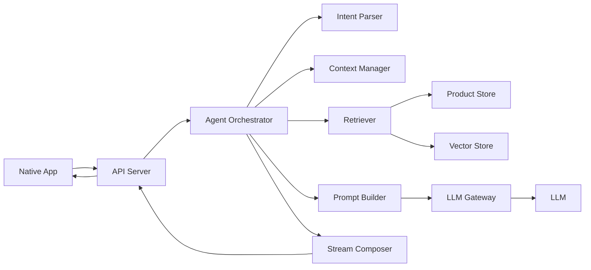
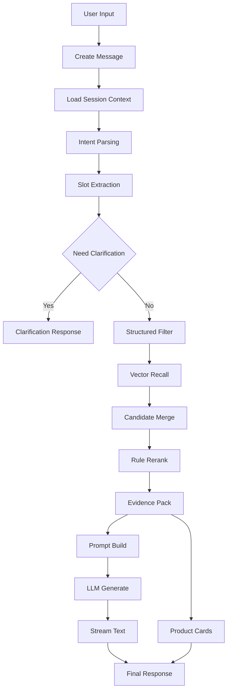

# 后端业务技术选型与流程设计文档

## 1. 文档目标

本文档面向后端开发、客户端开发、产品和答辩讲解人员，用于在正式开发前明确“基于 RAG 的多模态电商智能导购 AI Agent”的后端架构、技术选型、RAG 流程、接口边界、数据治理方式和分阶段交付范围。

本项目后端的核心目标不是构建完整电商交易系统，而是跑通一个可演示、可解释、可扩展的导购 Agent 链路：

- 接收原生 App 的用户对话请求。
- 从 `ecommerce_agent_dataset` 商品数据中检索可信依据。
- 基于 RAG 和 LLM 生成导购回复。
- 通过流式 API 返回自然语言内容。
- 同时返回结构化商品卡片、推荐依据、追问建议和错误状态。
- 严格控制幻觉，不编造库外商品、价格、库存、优惠、功效。

## 2. 后端整体架构

### 2.1 技术路线结论

推荐后端采用 `Python FastAPI`。

推荐理由：

- `FastAPI` 对异步接口和 SSE 流式返回支持成熟，适合快速完成 Demo。
- Python 生态在 RAG、向量库、Embedding、LLM 调用、文本处理方面最完整。
- 项目数据量只有 50 到 100 条商品，Python 的开发效率优先级高于极致性能。
- 后续接入 LangChain、LlamaIndex、Chroma、Qdrant、OpenAI-compatible SDK 都比较顺滑。
- 答辩时更容易解释 RAG 链路、Prompt 构造和数据处理逻辑。

不优先选择：

- `Node.js`：适合前后端同栈和实时服务，但 RAG 生态、文本处理和向量工具链没有 Python 顺手。
- `Go`：性能和部署优秀，但本项目更重 Agent 编排、模型调用和快速迭代，Go 会增加 Demo 开发成本。

### 2.2 架构分层

后端建议拆为 6 个核心模块：

- `API Server`：对客户端暴露 HTTP/SSE 接口，处理鉴权、参数校验、响应封装和错误映射。
- `Agent Orchestrator`：对话编排核心，负责意图识别、上下文管理、检索策略选择、Prompt 组装、工具调用和输出组织。
- `Retriever`：检索服务，负责结构化过滤、向量召回、候选合并、规则排序和证据组织。
- `Vector Store`：向量数据库，存储商品知识 chunk 的 embedding 和 metadata。
- `Product Store`：商品结构化存储，保存商品、SKU、价格、类目、图片路径等确定性字段。
- `LLM Gateway`：模型调用网关，统一封装 LLM 和 Embedding 调用、超时、重试、限流和日志脱敏。


### 2.3 架构图



### 2.4 模块职责

#### API Server

职责：

- 提供对话发送、流式回复、商品详情、会话历史、购物车等接口。
- 校验请求参数，例如 `session_id`、`message`、`product_id`。
- 将后端内部错误映射为客户端可理解的错误类型。
- 维护请求级 trace ID，方便排查 Demo 问题。
- 对 SSE 响应进行事件封装。

不负责：

- 不直接拼 Prompt。
- 不直接访问向量库。
- 不做复杂业务决策。

#### Agent Orchestrator

职责：

- 读取会话上下文。
- 判断用户意图，例如推荐、筛选、对比、追问、反选、购物车操作。
- 抽取结构化参数，例如类目、预算、品牌、功效、尺码、颜色、排除条件。
- 决定是否需要澄清追问。
- 调用 Retriever 获取候选商品和证据。
- 组装 Prompt 并调用 LLM。
- 将 LLM 文本、商品卡片、追问建议组织为流式事件。

#### Retriever

职责：

- 根据意图选择检索方式。
- 对价格、类目、品牌、SKU 属性等确定性条件做结构化过滤。
- 对功效、使用场景、用户偏好等语义条件做向量召回。
- 合并商品描述、FAQ、用户评价等多类 evidence。
- 对候选商品进行规则排序和截断。
- 返回可追溯证据，不返回裸文本堆砌。

#### Vector Store

职责：

- 存储所有非结构化知识 chunk 的向量。
- 支持按 metadata 过滤，例如类目、商品 ID、chunk 类型。
- 返回相似度分数、chunk 文本和 metadata。

首期推荐本地 `Chroma DB`。

#### Product Store

职责：

- 保存商品基础信息。
- 保存 SKU 列表和价格。
- 提供商品详情查询。
- 提供商品卡片展示字段。
- 作为价格、SKU、类目、图片等确定性字段的唯一来源。

首期推荐 `SQLite`。

#### LLM Gateway

职责：

- 封装 Doubao 或其他 OpenAI-compatible 模型调用。
- 统一设置模型名、Base URL、API Key、超时、重试。
- API Key 只能通过环境变量读取，不能写入代码或文档样例。
- 记录模型耗时、token、错误类型。
- 对请求和响应做日志脱敏。

## 3. 流式输出方案

### 3.1 推荐 SSE

推荐采用 `SSE` 作为 Phase 1 和 Phase 2 的流式输出方案。

理由：

- 对“客户端发送一条消息，服务端持续返回回复”的场景足够。
- HTTP 语义简单，便于调试和 Demo。
- 客户端实现成本低于 WebSocket。
- 服务端可以按事件类型返回文本、状态、商品卡片、追问建议和错误。
- 断线后可通过重试机制恢复。

### 3.2 WebSocket 适用场景

WebSocket 可作为 Phase 4 或后续扩展，适用于：

- 语音实时输入和播报。
- 多端协同会话。
- 购物车状态双向实时同步。
- 长时间 Agent 任务编排。

当前 Demo 不建议优先做 WebSocket，除非客户端已有成熟封装。

### 3.3 SSE 事件类型

建议事件类型：

- `status`：后端状态，例如理解中、检索中、生成中。
- `delta`：LLM 流式文本片段。
- `product_cards`：结构化商品卡片列表。
- `clarification`：澄清问题和快捷选项。
- `preference_tags`：已识别用户偏好。
- `evidence`：推荐依据摘要。
- `done`：本轮回复完成。
- `error`：本轮回复失败。

示例事件语义：

```json
{
  "event": "product_cards",
  "data": {
    "cards": [
      {
        "product_id": "p_beauty_001",
        "title": "雅诗兰黛特润修护肌活精华露淡纹紧致保湿夜间修护抗初老精华30ml",
        "brand": "雅诗兰黛",
        "price_display": "720 元起",
        "reason_tags": ["夜间修护", "保湿", "抗初老"],
        "risk_tips": ["敏感肌建议先做局部测试"]
      }
    ]
  }
}
```

## 4. 技术选型建议

### 4.1 推荐选型表

| 层次 | 推荐方案 | 说明 |
| --- | --- | --- |
| 后端框架 | FastAPI | 异步友好，API 文档自动生成，适合 SSE |
| ASGI Server | Uvicorn | 本地开发简单，和 FastAPI 配套成熟 |
| 向量数据库 | Chroma | 本地持久化简单，适合 50 到 100 条商品 Demo |
| 结构化存储 | SQLite | 保存商品、SKU、会话、购物车等结构化数据 |
| Embedding 模型 | 优先使用可访问的中文 embedding 模型 | PDF 建议 Doubao embedding，但未提供 Key；可使用本地或云端中文 embedding |
| LLM | Doubao-Seed-2.0-lite 或 OpenAI-compatible 模型 | 通过 LLM Gateway 统一封装 |
| 配置管理 | `.env` + Pydantic Settings | API Key、模型名、超时、数据库路径外置 |
| 日志 | 标准 logging + JSON 日志结构 | 记录 trace_id、session_id、intent、latency |
| 错误处理 | 统一异常类型和错误码 | 客户端可按错误类型展示重试、空结果、超时 |
| 本地部署 | Python venv + requirements.txt + SQLite + Chroma persistence | 降低 Demo 配置成本 |
| 可选容器化 | Docker Compose | 后续可一键启动 API、向量库和数据导入任务 |

### 4.2 向量数据库选择

首期推荐 `Chroma`。

原因：

- 本地部署成本低，不需要额外服务。
- 数据量小，性能足够。
- 支持 metadata 过滤。
- 便于快速重建索引。

后续替代方案：

- `Qdrant`：如果需要更稳定的服务化向量库和过滤能力，可在 Phase 3 以后替换。
- `Milvus`：适合更大数据量，不适合本 Demo 首期。
- `pgvector`：如果后端已经使用 PostgreSQL，可减少组件数量。

### 4.3 数据存储选择

首期建议：

- 商品原始 JSON 保留在 `ecommerce_agent_dataset`。
- 启动或导入脚本将 JSON 转换为 SQLite 表和 Chroma 向量索引。
- 商品详情接口从 SQLite 读取，避免从向量库拼结构化字段。

不建议：

- 直接让 LLM 从 chunk 文本中抽价格和 SKU。
- 把所有商品字段只存向量库。
- 在客户端硬编码商品卡片。

### 4.4 配置管理

所有敏感配置必须通过环境变量或 `.env` 文件读取：

- `LLM_BASE_URL`
- `LLM_API_KEY`
- `LLM_MODEL`
- `EMBEDDING_MODEL`
- `DATABASE_URL`
- `CHROMA_PERSIST_DIR`
- `REQUEST_TIMEOUT_SECONDS`

要求：

- `.env` 不提交仓库。
- README 中只写变量名，不写真实 Key。
- 日志中不打印 Key、完整 Prompt、用户隐私信息。

### 4.5 日志与错误处理

日志字段建议：

- `trace_id`
- `session_id`
- `message_id`
- `intent`
- `filters`
- `retrieved_product_ids`
- `retrieval_latency_ms`
- `llm_latency_ms`
- `total_latency_ms`
- `error_type`

错误类型建议：

- `BAD_REQUEST`：请求参数错误。
- `RETRIEVAL_EMPTY`：检索为空。
- `LLM_TIMEOUT`：模型超时。
- `LLM_ERROR`：模型调用失败。
- `STREAM_INTERRUPTED`：流式响应中断。
- `PRODUCT_NOT_FOUND`：商品不存在。
- `INTERNAL_ERROR`：未知服务错误。

## 5. 数据模型与入库流程

### 5.1 样例数据结构

`ecommerce_agent_dataset` 每个商品 JSON 主要包含：

- `product_id`：商品 ID。
- `title`：商品标题。
- `brand`：品牌。
- `category`：一级类目，例如美妆护肤、数码电子、服饰运动、食品饮料。
- `sub_category`：子类目，例如精华、智能手机、短袖 T 恤、咖啡。
- `base_price`：基础价格。
- `image_path`：商品主图路径。
- `skus`：SKU 列表，每个 SKU 包含规格属性和价格。
- `rag_knowledge.marketing_description`：营销描述和使用建议。
- `rag_knowledge.official_faq`：官方 FAQ。
- `rag_knowledge.user_reviews`：用户评价。

这些字段天然分为两类：

- 结构化事实：商品 ID、标题、品牌、类目、SKU、价格、图片。
- 非结构化知识：营销描述、FAQ、用户评价。

### 5.2 结构化表设计

#### products

字段建议：

- `product_id`
- `title`
- `brand`
- `category`
- `sub_category`
- `base_price`
- `image_path`
- `min_price`
- `max_price`
- `created_at`
- `updated_at`

说明：

- `min_price` 和 `max_price` 从 SKU 价格聚合生成。
- 商品卡片价格展示优先使用 `min_price` 到 `max_price`。
- 商品标题、品牌、类目不得由 LLM 改写后作为事实返回。

#### skus

字段建议：

- `sku_id`
- `product_id`
- `properties_json`
- `price`

说明：

- `properties_json` 保存容量、颜色、尺码、存储、口味、包装等差异化属性。
- SKU 选择和价格展示必须来自该表。
- 如果用户问“哪个规格划算”，后端应基于 SKU 价格和规格做确定性计算，再交给 LLM 组织语言。

#### knowledge_chunks

字段建议：

- `chunk_id`
- `product_id`
- `chunk_type`
- `chunk_text`
- `source_index`
- `metadata_json`
- `embedding_id`

`chunk_type` 可取：

- `marketing_description`
- `official_faq`
- `user_review`
- `sku_summary`
- `product_summary`

### 5.3 Chunking 策略

#### marketing_description

处理方式：

- 每个商品的营销描述可以切成 1 到 3 个 chunk。
- 按主题切分，例如核心卖点、适用人群、使用建议、注意事项。
- 数据量较小时可先保持单 chunk，避免过度切分导致上下文丢失。

metadata：

- `product_id`
- `category`
- `sub_category`
- `brand`
- `chunk_type: marketing_description`
- `price_min`
- `price_max`

#### official_faq

处理方式：

- 每个 FAQ 问答对单独作为一个 chunk。
- chunk 文本包含 question 和 answer。

metadata：

- `product_id`
- `chunk_type: official_faq`
- `faq_index`
- `question`
- `category`
- `sub_category`

适用场景：

- 规格选择。
- 功效解释。
- 使用注意事项。
- 保养方式。
- 成分或技术说明。

#### user_reviews

处理方式：

- 每条用户评价单独作为一个 chunk。
- metadata 中保留评分。
- 检索后可按评分聚合为好评点和差评点。

metadata：

- `product_id`
- `chunk_type: user_review`
- `review_index`
- `rating`
- `nickname`
- `category`
- `sub_category`

适用场景：

- 用户问“真实评价怎么样？”
- 对比优缺点。
- 判断风险，例如敏感肌刺痛、续航不满意、尺码偏长。

### 5.4 入库流程

流程：

1. 扫描 `ecommerce_agent_dataset/**/data/*.json`。
2. 校验 JSON 字段完整性。
3. 写入 `products` 表。
4. 遍历 `skus` 写入 `skus` 表。
5. 生成 `product_summary` chunk，包含标题、品牌、类目、子类目、价格区间、SKU 摘要。
6. 处理 `marketing_description` chunk。
7. 处理 `official_faq` chunk。
8. 处理 `user_reviews` chunk。
9. 调用 Embedding 模型生成向量。
10. 写入 Vector Store，并保存 chunk metadata。
11. 输出导入报告，例如商品数、SKU 数、chunk 数、失败文件。

### 5.5 结构化字段防幻觉

原则：

- 价格、SKU、品牌、类目、图片路径只从 Product Store 读取。
- LLM 只能基于后端提供的商品事实和证据组织语言。
- 返回给客户端的商品卡片由后端组装，不由 LLM 自由生成。
- LLM 输出中如包含价格，必须由 Prompt 明确要求引用后端提供字段。
- 服务端可在最终输出前做一次事实校验，发现库外商品或价格不一致则降级为结构化卡片和保守文案。

## 6. RAG 核心链路

### 6.1 总流程



### 6.2 用户输入

输入来源：

- 自由文本。
- 示例问题。
- 澄清选项。
- 商品卡片快捷问题。
- Phase 4 可扩展图片或语音转文本。

后端接收后应记录：

- `session_id`
- `message_id`
- `user_text`
- `client_context`
- `recent_product_ids`
- `timestamp`

### 6.3 意图识别

意图类型建议：

- `recommendation`：推荐商品。
- `filter_search`：条件筛选。
- `clarification_answer`：回答澄清问题。
- `compare_products`：商品对比。
- `exclude_search`：包含排除条件的推荐。
- `product_detail_qa`：围绕某个商品继续问。
- `scenario_bundle`：场景化组合推荐。
- `cart_action`：购物车操作。
- `unknown`：无法识别。

Phase 1 可用规则 + LLM 轻量分类结合：

- 规则识别价格、类目、对比词、排除词。
- LLM 负责模糊意图和复杂表达。

### 6.4 参数抽取

槽位建议：

- `category`
- `sub_category`
- `brand_include`
- `brand_exclude`
- `price_min`
- `price_max`
- `sku_properties`
- `positive_preferences`
- `negative_preferences`
- `scenario`
- `target_user`
- `compare_product_ids`
- `referenced_product_id`

示例：

用户输入：“推荐防晒霜，但不要含酒精，也不要日系品牌。”

抽取结果：

```json
{
  "intent": "exclude_search",
  "slots": {
    "sub_category": "防晒霜",
    "negative_preferences": ["含酒精"],
    "brand_exclude": ["日系品牌"]
  }
}
```

### 6.5 结构化过滤

适合结构化过滤的条件：

- 类目和子类目。
- 品牌包含或排除。
- 价格范围。
- SKU 属性，例如容量、颜色、尺码、存储、包装。

不适合直接结构化过滤的条件：

- “适合油皮”
- “轻量”
- “送礼好看”
- “性价比高”
- “不刺激”

这些语义条件应进入向量召回和证据判断。

### 6.6 向量召回

召回策略：

- 对用户 query 和已识别上下文合成检索 query。
- 优先在结构化过滤后的商品范围内召回。
- 按 chunk 类型召回，避免单一营销描述压制 FAQ 和评价。

建议召回配比：

- `product_summary`：每类 3 到 5 条。
- `marketing_description`：Top 5。
- `official_faq`：Top 5。
- `user_review`：Top 5 到 10。

### 6.7 Rerank 和规则排序

首期可采用规则排序，不必引入复杂 reranker。

排序因素：

- 结构化条件匹配程度。
- 向量相似度。
- 价格是否满足预算。
- 类目是否精确匹配。
- 负向条件是否冲突。
- 用户评价风险是否过高。
- SKU 是否可展示。

建议打分：

- 类目精确匹配加权。
- 预算满足加权。
- FAQ 命中用户问题加权。
- 负向条件冲突直接排除或降权。

### 6.8 Prompt 构造

Prompt 输入应包含：

- 系统角色和安全边界。
- 用户当前问题。
- 会话上下文摘要。
- 已识别槽位。
- 候选商品事实。
- 检索证据。
- 输出格式要求。
- 禁止事项。

候选商品事实必须结构化传入，例如：

```json
{
  "product_id": "p_beauty_001",
  "title": "雅诗兰黛特润修护肌活精华露淡纹紧致保湿夜间修护抗初老精华30ml",
  "brand": "雅诗兰黛",
  "category": "美妆护肤",
  "sub_category": "精华",
  "price_range": "720-1260",
  "skus": [
    {"sku_id": "s_p_beauty_001_1", "properties": {"容量": "30ml 经典装"}, "price": 720}
  ],
  "evidence": [
    {"type": "marketing_description", "text": "主打夜间肌底修护..."},
    {"type": "official_faq", "text": "敏感肌使用前建议先做耳后测试..."},
    {"type": "user_review", "rating": 1, "text": "用了两次就脸颊泛红刺痛..."}
  ]
}
```

### 6.9 LLM 生成

生成策略：

- 先让 LLM 生成自然语言导购回答。
- 商品卡片由后端根据候选商品生成，不依赖 LLM 输出。
- LLM 可以输出推荐排序和推荐理由，但后端需要校验商品 ID 是否在候选集中。

流式策略：

- 在进入 LLM 前先向客户端发送 `status: generating`。
- LLM token 流作为 `delta` 返回。
- LLM 生成同时或结束后发送 `product_cards`。
- 结束时发送 `done`。

### 6.10 商品卡片结构化返回

商品卡片字段：

- `product_id`
- `title`
- `brand`
- `category`
- `sub_category`
- `image_path`
- `price_display`
- `default_sku_id`
- `sku_summary`
- `recommend_reasons`
- `risk_tips`
- `evidence_refs`

商品卡片生成原则：

- `title`、`brand`、`price_display`、`image_path` 从 Product Store 读取。
- `recommend_reasons` 可由 Retriever 和 LLM 共同生成，但必须绑定 evidence。
- `risk_tips` 优先来自 FAQ 注意事项和低分评价。

## 7. Agent 能力设计

### 7.1 单轮推荐

输入示例：

- “推荐一款适合油皮的洗面奶。”

处理策略：

- 抽取类目和偏好。
- 结构化过滤类目。
- 向量召回功效、肤质、评价。
- 返回 1 到 3 个商品。
- 给出推荐理由和风险提示。

验收标准：

- 推荐商品必须来自库内。
- 推荐理由至少包含一个 evidence。
- 有商品卡片返回。

### 7.2 条件筛选

输入示例：

- “200 元以内的蓝牙耳机有哪些？”

处理策略：

- 抽取 `price_max=200` 和 `sub_category=蓝牙耳机`。
- 先按结构化价格过滤。
- 再做语义召回和排序。
- 如果无结果，说明无匹配并建议放宽条件。

验收标准：

- 返回商品价格不得超过用户预算。
- 无结果不能编造低价商品。

### 7.3 多轮上下文

输入示例：

- 用户：“帮我推荐跑鞋。”
- 用户：“要轻量的。”
- 用户：“预算 500 以内。”

处理策略：

- 为每个 session 维护上下文摘要和槽位状态。
- 新输入和历史槽位合并。
- 用户后续补充应覆盖或增强旧条件。
- 用户说“再便宜点”“换一个”“第二个”时解析引用。

验收标准：

- 不要求用户重复上一轮条件。
- 后端返回 `preference_tags` 给客户端展示。

### 7.4 主动澄清

触发条件：

- 类目过大。
- 候选商品过多且差异大。
- 关键信息缺失，例如预算、用途、肤质。
- 用户条件冲突或无法满足。

处理策略：

- 一次只问一个关键问题。
- 返回 `clarification` 事件。
- 提供 3 到 4 个选项。
- 用户可点击选项或自由输入。

验收标准：

- 输入“推荐手机”时不能直接堆商品，应优先询问拍照、续航、预算或性价比。

### 7.5 反选和排除约束

输入示例：

- “推荐防晒霜，但不要含酒精，也不要日系品牌。”

处理策略：

- 抽取正向条件和负向条件。
- 品牌、类目、价格等可结构化排除。
- 成分、体验等语义排除需要基于 evidence 判断。
- 如果资料未明确，不得强行判定“不含”。

验收标准：

- 返回排除标签。
- 冲突商品不进入推荐卡片。
- 无法确认时给出保守说明。

### 7.6 多商品对比

输入示例：

- “这两款面霜哪个更保湿？”

处理策略：

- 从最近展示商品中解析“这两款”。
- 分别检索两个商品的描述、FAQ、评价。
- 按价格、适用人群、核心卖点、风险、评价倾向输出对比。
- 给出明确推荐结论。

验收标准：

- 对比对象必须明确。
- 对比维度必须绑定 evidence。
- 如果无法解析“这两款”，主动要求用户点选或输入商品。

### 7.7 无结果兜底

无结果类型：

- 商品库无对应类目。
- 价格或排除条件过严。
- 向量召回低于阈值。
- 用户问库外信息，例如物流、库存、优惠券。

兜底策略：

- 说明当前商品库没有完全匹配。
- 展示已识别条件。
- 提供放宽建议。
- 不编造商品。

### 7.8 防幻觉策略

核心策略：

- 只允许回答候选商品集合内的信息。
- 商品卡片由后端生成。
- Prompt 中明确禁止编造优惠、库存、价格、功效。
- 输出前校验商品 ID 和价格。
- 对 evidence 不足的问题，回答“不确定”或“当前资料未明确”。
- 对用户要求库外信息时，明确说明暂不支持。

## 8. API 设计草案

以下为接口草案，不是最终代码实现。

### 8.1 发送对话消息并流式返回

接口：

- `POST /api/v1/chat/stream`

请求：

```json
{
  "session_id": "sess_001",
  "message_id": "msg_001",
  "message": "推荐一款适合油皮的洗面奶",
  "client_context": {
    "recent_product_ids": [],
    "source": "manual_input"
  }
}
```

响应：

- `Content-Type: text/event-stream`
- 返回 `status`、`delta`、`product_cards`、`clarification`、`done`、`error` 等事件。

### 8.2 非流式调试对话接口

接口：

- `POST /api/v1/chat`

用途：

- 后端本地调试。
- 自动化测试。
- 不建议作为客户端正式接口。

响应：

```json
{
  "session_id": "sess_001",
  "assistant_message": "我推荐你优先看...",
  "product_cards": [],
  "preference_tags": ["油皮", "洗面奶"],
  "evidence": [],
  "debug": {
    "intent": "recommendation",
    "retrieved_product_ids": []
  }
}
```

### 8.3 获取商品详情

接口：

- `GET /api/v1/products/{product_id}`

响应：

```json
{
  "product_id": "p_beauty_001",
  "title": "雅诗兰黛特润修护肌活精华露淡纹紧致保湿夜间修护抗初老精华30ml",
  "brand": "雅诗兰黛",
  "category": "美妆护肤",
  "sub_category": "精华",
  "image_path": "1_美妆护肤/images/p_beauty_001_live.jpg",
  "price_range": {
    "min": 720,
    "max": 1260
  },
  "skus": [
    {
      "sku_id": "s_p_beauty_001_1",
      "properties": {"容量": "30ml 经典装"},
      "price": 720
    }
  ],
  "knowledge_summary": {
    "marketing": [],
    "faq": [],
    "review_pros": [],
    "review_cons": []
  }
}
```

### 8.4 获取商品卡片数据

接口：

- `POST /api/v1/products/cards`

请求：

```json
{
  "product_ids": ["p_beauty_001", "p_digital_001"]
}
```

响应：

```json
{
  "cards": [
    {
      "product_id": "p_beauty_001",
      "title": "雅诗兰黛特润修护肌活精华露淡纹紧致保湿夜间修护抗初老精华30ml",
      "brand": "雅诗兰黛",
      "price_display": "720-1260 元",
      "image_path": "1_美妆护肤/images/p_beauty_001_live.jpg",
      "sku_summary": "30ml / 50ml / 75ml",
      "recommend_reasons": [],
      "risk_tips": []
    }
  ]
}
```

### 8.5 会话历史

接口：

- `GET /api/v1/sessions/{session_id}/messages`

响应：

```json
{
  "session_id": "sess_001",
  "messages": [
    {
      "message_id": "msg_001",
      "role": "user",
      "content": "推荐一款适合油皮的洗面奶",
      "created_at": "2026-05-20T19:00:00Z"
    },
    {
      "message_id": "msg_002",
      "role": "assistant",
      "content": "我推荐你优先看...",
      "product_ids": ["p_beauty_001"],
      "created_at": "2026-05-20T19:00:03Z"
    }
  ]
}
```

### 8.6 购物车接口（Phase 4 可选）

接口：

- `GET /api/v1/cart`
- `POST /api/v1/cart/items`
- `PATCH /api/v1/cart/items/{item_id}`
- `DELETE /api/v1/cart/items/{item_id}`
- `POST /api/v1/cart/checkout/preview`

说明：

- Phase 1 可不实现。
- Phase 4 若选择购物车闭环，Agent Orchestrator 需要把自然语言操作转换为结构化 CRUD。

## 9. Prompt 策略

### 9.1 系统 Prompt 原则

核心原则：

- 你是电商智能导购，不是通用百科助手。
- 只能基于后端提供的候选商品和证据回答。
- 不得编造商品、价格、库存、优惠券、物流、功效、成分。
- 如果资料没有明确提到，需要回答“当前商品资料未明确”。
- 推荐理由必须绑定商品资料、FAQ 或用户评价。
- 信息不足时先主动追问，不要强行推荐。
- 输出要适合移动端阅读，先给结论，再给理由。
- 如果涉及商品卡片，使用后端提供的商品 ID，不要生成新商品 ID。

### 9.2 输出结构要求

LLM 输出自然语言部分建议包含：

- 简短结论。
- 推荐理由。
- 风险提示。
- 下一步追问。

结构化商品卡片不建议由 LLM 直接生成完整字段，而是由后端根据推荐结果组装。

### 9.3 商品事实输入原则

Prompt 中商品事实应使用清晰结构：

- 商品 ID。
- 标题。
- 品牌。
- 类目。
- 价格区间。
- SKU 摘要。
- evidence 列表。

Prompt 不应传入整个商品 JSON，避免上下文过长和模型抓错重点。

### 9.4 防幻觉 Prompt 约束示例

可在系统 Prompt 中加入如下约束：

```text
你只能使用“候选商品事实”和“检索证据”中的信息回答。
如果用户询问的信息没有出现在候选商品事实或检索证据中，请明确说“当前商品资料未明确”，不要猜测。
不得编造不存在的商品、SKU、价格、库存、优惠券、物流时效、品牌承诺或功效。
涉及价格、SKU、品牌、类目时，必须逐字使用候选商品事实中的字段。
推荐理由必须能对应到 evidence 中的商品资料、FAQ 或用户评价。
```

## 10. Phase 后端交付范围

### 10.1 Phase 1：最小 RAG 闭环

目标：

- 跑通“用户提问 -> RAG 检索 -> LLM 生成 -> SSE 流式返回 -> 商品卡片”的完整链路。

范围：

- 商品 JSON 导入。
- SQLite 商品和 SKU 存储。
- Chroma 向量索引。
- 基础推荐和条件筛选。
- SSE 流式接口。
- 商品卡片接口。
- 商品详情接口。
- 基础错误处理。

不做：

- 复杂多轮记忆。
- 购物车。
- 图片和语音。
- 高级 rerank。

### 10.2 Phase 2：多轮上下文和澄清

目标：

- 让 Agent 能逐步收敛用户需求。

范围：

- 会话上下文表。
- 槽位抽取和合并。
- 主动澄清事件。
- 偏好标签返回。
- “再便宜点”“换一个”“第二个”等基础指代处理。

### 10.3 Phase 3：反选、对比、场景化推荐

目标：

- 展示 Agent 对复杂导购语义的理解能力。

范围：

- 排除条件解析。
- 负向条件过滤。
- 多商品对比。
- FAQ 和评价聚合。
- 场景化组合推荐。
- 更严格的事实校验。

### 10.4 Phase 4：加分项方向

候选方向：

- 购物车闭环：自然语言加购、删除、改数量、模拟下单。
- 多模态：语音输入、TTS、拍照找货。
- 性能优化：热门 query 缓存、首 token 优化、检索和 LLM 并行。
- RAG 增强：query rewrite、hybrid search、reranker、证据可视化。

推荐方向：

- 优先做“RAG 增强 + 对话智能”，包括反选、多商品对比、证据引用和无幻觉校验。
- 如果时间允许，再补“购物车入门闭环”，实现自然语言加购和购物车状态展示。

## 11. 风险与应对

### 11.1 技术风险

风险：

- SSE 在移动端断线或后台切换时中断。
- LLM 响应时间不稳定。
- 向量召回不稳定，推荐结果偶发跑偏。

应对：

- 客户端支持重试。
- 服务端设置超时和降级。
- 先返回检索状态和候选商品，再等待 LLM 文本。
- 保留非流式调试接口便于排查。

### 11.2 数据风险

风险：

- 数据集只有 50 到 100 条，覆盖面有限。
- 部分用户问题没有对应类目或属性。
- 商品描述、FAQ、评价中可能缺少成分、库存、物流等字段。

应对：

- 明确提示“当前商品库没有匹配结果”。
- 给出放宽条件建议。
- 不回答数据集中没有的事实。
- Demo 问题优先选择数据覆盖的场景。

### 11.3 模型幻觉风险

风险：

- LLM 编造价格、优惠、库存。
- LLM 推荐候选集之外的商品。
- LLM 对资料不足的问题做过度承诺。

应对：

- Prompt 明确约束。
- 商品卡片由后端生成。
- 输出前校验商品 ID 和价格。
- 对不确定字段统一使用“资料未明确”。

### 11.4 性能风险

风险：

- 首 token 时间过长。
- Embedding 或向量库初始化慢。
- Demo 现场网络不稳定。

应对：

- 启动时预加载索引。
- 热门 Demo query 预热。
- 设置模型调用超时。
- 检索和商品卡片先返回，LLM 文本后返回。
- 本地保留 fallback 文案用于说明服务异常，但不伪造推荐。

### 11.5 Demo 风险

风险：

- API Key 配置错误。
- 数据未导入。
- 图片路径不匹配。
- 客户端和后端事件协议不一致。

应对：

- 提供启动前健康检查。
- 提供数据导入报告。
- 提供 `/health` 和 `/debug/retrieval` 接口。
- 前后端提前锁定 SSE 事件协议。
- Demo 脚本选择覆盖数据集的稳定问题。

## 12. 后端验收标准

### 12.1 Phase 1 验收

必须满足：

- 数据导入成功，商品数、SKU 数、chunk 数可统计。
- 对话流式接口可返回 `status`、`delta`、`product_cards`、`done`。
- 用户输入推荐类问题时，能返回库内商品。
- 商品卡片中的价格、标题、品牌、图片来自 Product Store。
- 商品详情接口可查询完整 SKU 和知识摘要。
- 检索为空时不编造商品。
- LLM 超时和网络错误有明确错误事件。

### 12.2 Phase 2 验收

必须满足：

- 支持 session 级上下文。
- 能保留预算、类目、偏好等槽位。
- 能主动澄清模糊需求。
- 能返回 `clarification` 和 `preference_tags`。
- 用户补充条件后能基于上一轮继续推荐。

### 12.3 Phase 3 验收

必须满足：

- 支持排除条件解析。
- 支持两商品对比。
- 对比维度包含价格、卖点、风险、评价倾向。
- 反选条件无结果时能说明原因。
- 资料不足时不做绝对判断。

### 12.4 Phase 4 验收

按选择方向验收：

- 购物车方向：自然语言加购、删除、改数量至少覆盖两个操作。
- 多模态方向：语音或图片输入能转成可检索语义。
- 性能方向：首 token 和总耗时有可观测指标。
- RAG 增强方向：证据引用、rerank、query rewrite 或防幻觉校验有明确效果展示。

## 13. 开发落地建议

建议后端任务拆分：

1. 定义数据模型和导入脚本。
2. 实现 Product Store 查询。
3. 实现 Chunk 生成和向量索引。
4. 实现 Retriever。
5. 实现 Agent Orchestrator。
6. 实现 LLM Gateway。
7. 实现 SSE 流式接口。
8. 实现商品详情和卡片接口。
9. 实现日志、错误处理和健康检查。
10. 对接客户端联调 Demo 脚本。

最小可演示顺序：

1. 先让商品详情接口返回正确数据。
2. 再让检索接口能召回商品。
3. 再接 LLM 生成自然语言。
4. 最后接 SSE 和商品卡片事件。

## 14. 结论

本项目后端应优先选择 `FastAPI + SQLite + Chroma + LLM Gateway + SSE` 的轻量架构。该方案组件少、开发快、可解释性强，适合课题要求的端到端 Demo。

首期要把最小 RAG 闭环做稳：商品数据入库、结构化过滤、向量召回、LLM 流式回答、商品卡片返回、防幻觉约束。后续再逐步增强多轮上下文、主动澄清、反选、多商品对比和购物车闭环。

