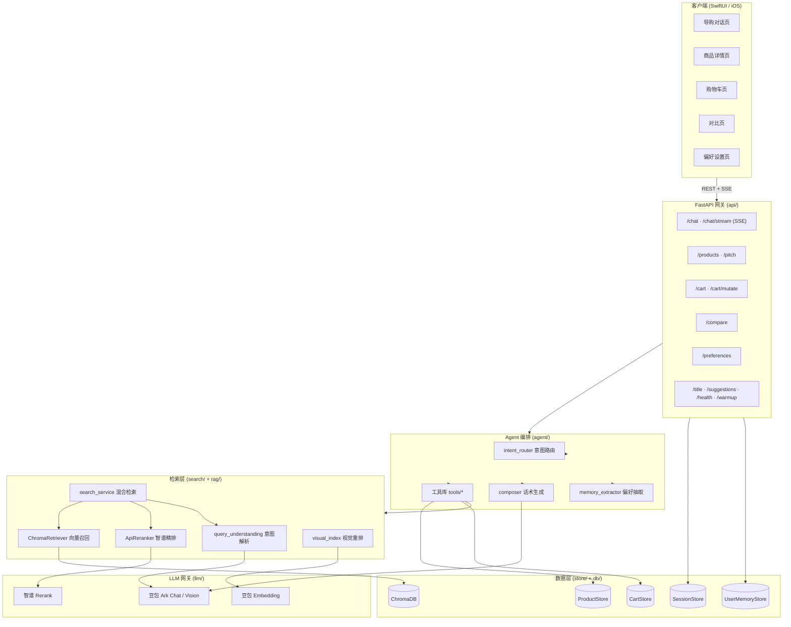
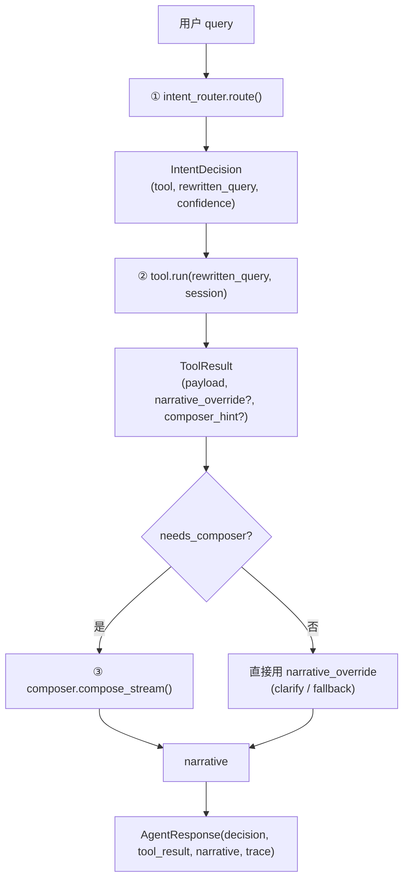
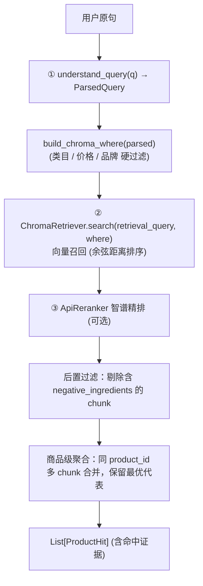
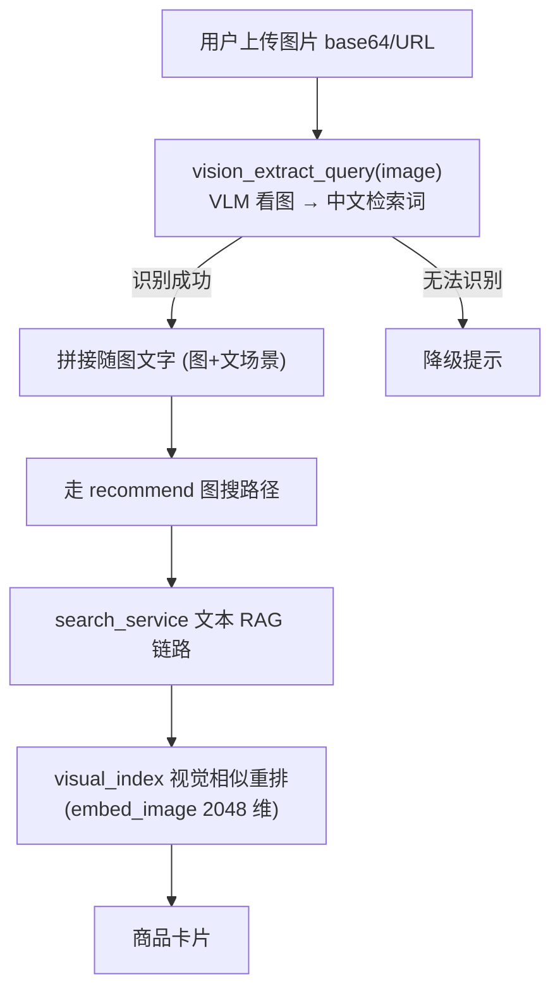
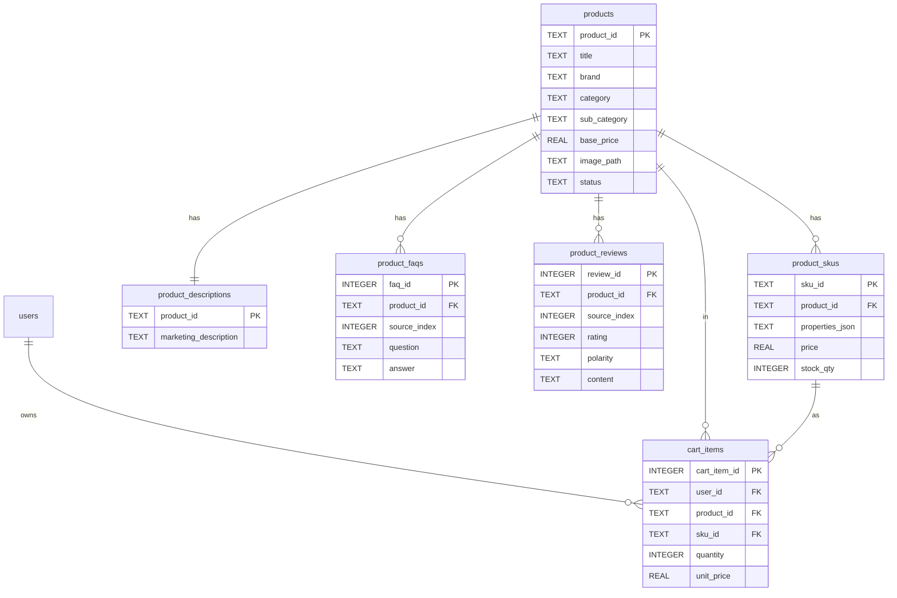

# 多模态电商智能导购 AI Agent · 系统设计文档

> 版本：v1.0　|　最后更新：2026-06-10
>
> 本文是项目的总体技术设计文档，面向后端 / 客户端 / 算法 / 答辩讲解人员，系统性地说明整体架构、各模块职责、核心数据流、关键设计决策与取舍。Docker / CI 部署部分待容器化验证后另行补充，本文不展开。

---

## 1. 项目概述

### 1.1 定位

本项目将传统“展示型电商”升级为“交互型导购”：用户用自然语言（必要时配合**语音、图片**）表达模糊购物意图，系统基于商品库、SKU、营销描述、官方 FAQ 与用户评价进行检索、分析与推荐，完成从**个性化推荐 → 商品对比 → 购物车管理**的自然对话闭环。

核心原则：

- **对话为主入口，商品卡片为转化承接**：聊天流中内嵌可点击的结构化商品卡片。
- **事实强一致，杜绝幻觉**：价格、SKU、库存、品牌、类目等确定性字段一律来自 SQLite，禁止由大模型自由生成。
- **检索可解释**：每个推荐结果都保留命中证据 chunk，支撑“为什么推荐”的解释。

### 1.2 技术栈总览

| 层 | 技术选型 | 说明 |
| --- | --- | --- |
| 客户端 | SwiftUI（iOS 17+） | 原生 App，REST + SSE，接管对话流 / 状态 / 多模态输入采集 |
| 后端网关 | FastAPI（Python 3.10+） | 异步服务，统一封装大模型调用、检索与事实 CRUD |
| Agent 编排 | 自研 `router → tool → composer` 三段式流水线 | LLM 仅负责意图分类，固定流水线负责执行 |
| 向量检索 | ChromaDB | 商品语义证据 chunk + 视觉特征索引 |
| 事实库 | SQLite（WAL 模式） | 商品 / SKU / 描述 / FAQ / 评价 / 购物车 / 会话 / 偏好 |
| 大模型 | 豆包 Ark（对话 / 意图 / 视觉 / embedding） | OpenAI 兼容协议 |
| 精排 | 智谱 Rerank（`/paas/v4/rerank`） | 云端二次重排，避免本地 torch 重依赖 |

---

## 2. 系统总体架构

### 2.1 分层架构图



### 2.2 模块职责一览

| 模块 | 目录 | 职责 |
| --- | --- | --- |
| API 网关 | `backend/api/` | HTTP/SSE 接口、参数校验、会话管理、SSE 事件封装、错误映射 |
| Agent 编排 | `backend/agent/` | 意图路由、工具调度、话术生成、偏好抽取、会话状态 |
| 检索引擎 | `backend/search/` | 自然语言 → 结构化查询、`where` 过滤构建、复合查询拆解、视觉索引 |
| RAG 模块 | `backend/rag/` | ChromaDB 向量召回、智谱精排、离线建库脚本 |
| 数据存储 | `backend/store/` | SQLite 事实层（商品 / 购物车 / 会话 / 偏好）读写 |
| LLM 网关 | `backend/llm/` | 豆包对话 / 视觉 / embedding、智谱 rerank 客户端单例 |
| 客户端 | `client/AIShoppingGuide/` | 原生 UI、SSE 流解析、本地状态管理、多模态输入采集 |

---

## 3. Agent 编排层设计

整个对话的“大脑”，采用 **`router → tool → composer` 三段式流水线**。设计哲学：**让 LLM 只负责分类，固定流水线负责执行**，相比让 LLM 自由 tool-calling，控制力、可观测性和流式上报能力都更强。

### 3.1 编排流水线



- **入口**：`Agent.handle_turn()`（非流式）与 `Agent.handle_turn_stream()`（流式生成器）。图搜走独立入口 `Agent.handle_image_turn_stream()`。
- **降级策略**（保证“永不崩链”）：
  - router 抛异常 → 默认走 `recommend`（电商 70% 流量是推荐，最安全的兜底，绝不退回 clarify）。
  - tool 抛异常 → 走 `fallback` 话术，并在 `trace` 记录错误。
  - composer 非流式异常 → 用本地兜底文案；流式中途异常 → 已 yield 的片段照常拼接入会话历史。

### 3.2 意图路由 `intent_router.py`

用**豆包 function calling**（`tool_choice` 强制调用 `route_to_tool`）把 query 分发到 7 个已注册工具之一：

| 工具 | 触发场景 |
| --- | --- |
| `recommend` | 找 / 挑 / 买商品（含模糊词，只要有品类线索） |
| `refine` | 基于上一轮推荐的调整（“再便宜点”“换个品牌”），或仅补充单一约束的短输入（单说“Adidas”“红色”） |
| `compare` | 对比 2+ 商品（“A 和 B 哪个好”“这两个区别”） |
| `product_detail` | 对某个具体商品深度追问（“第二个详细说说”“这款敏感肌能用吗”） |
| `cart` | 购物车与下单（加购 / 改数量 / 改规格 / 删除 / 看购物车 / 结算） |
| `clarify` | 模糊到无法检索（“随便看看”“有啥好东西”） |
| `fallback` | 与购物无关（天气、闲聊、超能力范围） |

关键设计：

- **enum 锁定**：用 function calling 的 `enum` 把输出锁死在已注册 tool 名上，比“请输出 JSON”稳定一个数量级。
- **query 改写**：`rewritten_query` 结合最近 4 轮对话改写为独立完整查询（“再便宜点”→“300 以内的精华”）。
- **重试兜底**：LLM 偶发不调用函数或漏填 `tool` 字段时，重试一次；仍失败退回 `recommend`。
- **置信度**：`confidence=low` 可触发 clarify。

### 3.3 工具库 `agent/tools/`

| 文件 | 职责 |
| --- | --- |
| `base.py` | `Tool` Protocol + 统一返回契约 `ToolResult`（`payload` / `composer_hint` / `narrative_override` / `needs_composer`） |
| `recommend.py` | 核心推荐：调 `SearchService` 完成混合检索，产出商品卡片 payload；支持图搜路径与多需求分组（groups） |
| `refine.py` | 基于上一轮 `last_parsed_query` 增量调整筛选条件（改预算 / 品牌 / 属性） |
| `compare.py` | 对比 2 件商品，复用 `comparison.build_comparison` 产出结构化对比表 |
| `product_detail.py` | 单品深度问答，基于该商品的描述 / FAQ / 评价证据回答追问 |
| `cart.py` | 对话式购物车 CRUD：经 `llm_actions.dispatch_action` 细分动作（add/remove/set_quantity/view/checkout），再用确定性代码操作 `CartStore` |
| `clarify.py` | 模糊意图反问，固定模板话术（`narrative_override`，不走 composer） |
| `fallback.py` | 非购物兜底话术 |
| `resolve.py` / `reference.py` | 指代消解：把“第二个”“刚才那款”解析到具体 `product_id`（序号 / 名称 / 焦点） |
| `llm_match.py` | LLM 辅助的商品名模糊匹配 |

`ToolResult` 契约是工具与 composer 解耦的关键：tool 关心“做了什么”（payload），composer 关心“怎么说”（narrative）。

### 3.4 话术生成 `composer.py`

- 两个入口：`compose()`（一次性，测试用）与 `compose_stream()`（流式，SSE / CLI 用）。
- **推荐场景**：要求 LLM 输出严格 JSON（`opening` / `items[{productId, description}]` / `followup[]`），其中 `productId` 必须原样取自 payload，禁止自造；`description` ≤ 45 字、不含价格；`followup` 是 3-5 条**用户视角**的可发送 prompt（祈使口吻，禁止反问句）。
- **单品问答场景**：用 `PRODUCT_DETAIL_SYSTEM_PROMPT`，输出自然中文（非 JSON），3-5 句基于证据回答。
- 风格与事实约束集中在 system prompt，换风格无需改 tool。

### 3.5 偏好抽取 `memory_extractor.py`

- **确定性 V1 抽取器**：只处理显式、低风险的偏好陈述（品牌、品类、风格如“轻量”），刻意**不引入第二条 LLM 写路径**。
- 主动忽略：临时性（“这次/今天/先”）、疑问句、健康 / 过敏 / 忌口 / 孕哺等高风险陈述。
- 抽取结果写入 `UserMemoryStore`，并返回带 `undo_token` 的 `memory_update` 事件供前端横幅展示与撤销。

### 3.6 会话与记忆分层 `session.py`

V1 三层记忆：

| 记忆层 | 范围 | 用途 |
| --- | --- | --- |
| Preference Core Memory | 每 `user_id` 一份，跨 session | 长期偏好（预算 / 品牌 / 关注品类），由 API 层加载挂到 `user_profile` |
| 工作记忆 `working_memory` | 单 turn 内 | `last_parsed_query`（refine 用）、`last_hits`、`last_focus_product_id`（指代消解用），用 `TypedDict` 固化键名契约 |
| Session 记忆 `history` | 当前 session | 对话原文滑动窗口，让 router 理解“再便宜点 / 对比第一个和第二个”指什么；超窗压成 `session_summary` |

---

## 4. 检索层设计（多模态 RAG）

### 4.1 混合检索流程 `search_service.py`

标准 hybrid retrieval 三段式：



- **单例化**：FastAPI 启动时 build 一次 `ChromaRetriever`，所有请求复用，保持 Chroma client / embedding 模型热状态（冷启动 ~64s，热查询 ~0.01s）。
- **排序分数**：启用 rerank 时用 `rerank_score`（高=好），否则退化为 `-best_distance`。
- **透明可解释**：每个 `ProductHit` 保留命中 `evidence` chunk。
- `USE_RERANK=0` 可关闭精排，仅走向量距离排序。

### 4.2 查询理解 `query_understanding.py`

- 产出 `ParsedQuery` 数据契约：`category` / `sub_category` / `max_price` / `min_price` / `brand_include` / `brand_exclude` / `negative_ingredients`（否定成分）/ `soft_terms` / `retrieval_query` / `needs_clarification` 等。
- **LLM 主力版**：解析全部交给 `search/llm_parser.py`（豆包 function calling），**不保留规则兜底**——规则版在覆盖率、否定语义、同义词上全面落后，LLM 不可用时直接 raise 由上层决策，比“悄悄给错误召回”更负责任。
- 配套：`query_decomposer.py`（复合查询拆解，如“衣服和防晒”拆成多组）、`where_builder.py`（`ParsedQuery` → Chroma `where` 过滤器）。

### 4.3 RAG 模块 `rag/`

| 文件 | 职责 |
| --- | --- |
| `retriever.py` | `ChromaRetriever`：运行时向量召回，输出标准化 `RetrievedChunk`（含 distance / metadata） |
| `reranker.py` | `ApiReranker`：调智谱 `/paas/v4/rerank`；响应按 document 文本回填对齐（不依赖返回顺序），轻量化镜像 |
| `chroma_store.py` | Chroma 集合封装与 embedding 配置 |
| `build_chroma.py` | 离线建库：把商品营销描述 / FAQ / 评价切成 chunk 并向量化（约 1092 chunks），仅离线运行 |
| `build_image_index.py` | 商品图视觉特征索引 |
| `build_compare_index.py` | 对比维度索引 |

**数据职责边界**：Chroma 只存语义证据 chunk；价格 / SKU / 图片路径虽在 metadata 中（便于过滤调试），但**最终事实来源是 SQLite**。两者通过 `product_id + source_index` 对齐。

### 4.4 多模态拍照找货



- 核心思路：**把图像问题转成已跑通的文本 RAG 问题**——VLM 把图片“看懂”成一句中文检索 query，复用整条 `search_service` 链路；再用图片 embedding 做视觉相似重排。
- 模态已知（就是图搜），无需 router LLM 分类，直接走图搜路径。
- 图+文场景：把随图文字并入检索词，让“找便宜点的同款”这类约束生效。

---

## 5. 数据存储层设计

### 5.1 SQLite 表结构 `db/init.sql`

WAL 模式 + 外键约束。SQLite 负责确定性商品事实、详情页结构化内容、SKU 价格与购物车。



| 表 / 视图 | 说明 |
| --- | --- |
| `products` | 商品主表（商品级稳定事实）。`base_price` 用于展示 / 粗排序 |
| `product_skus` | SKU 表，**规格、价格、购物车结算的真实来源**；“500 元以内”应判断是否存在满足价的 SKU |
| `product_descriptions` | 营销描述，详情页直接读取，与 Chroma marketing chunk 同源 |
| `product_faqs` | 官方 FAQ，`source_index` 与 Chroma chunk 对齐用于召回后回表 |
| `product_reviews` | 用户评价，含 `rating` 与 `polarity`（positive/neutral/negative），支撑风险提示 |
| `users` / `cart_items` | 演示用户与购物车，`cart_items` 保存 SKU、数量与下单价格快照 |
| `product_price_ranges`（视图） | 按 `MIN(price)` 聚合，供“xx 元起”展示与预算过滤 |

### 5.2 存储类 `store/`

| 文件 | 职责 |
| --- | --- |
| `product_store.py` | `ProductStore`：商品信息与 SKU 价格强一致性查询，`find_candidates()` / `get_product_detail()` |
| `cart_store.py` | `CartStore`：购物车 CRUD（add/remove/set_quantity/clear），SQLite 持久化、与会话解耦 |
| `session_store.py` | `SqliteSessionStore`：多轮会话历史持久化，重启可恢复上下文 |
| `user_memory_store.py` | `UserMemoryStore`：跨会话用户偏好（核心记忆），支持 `undo_token` 撤销 |
| `import_product_data.py` | 从 `data/` 原始 JSON 导入商品 / SKU / 描述 / FAQ / 评价 |
| `import_image_manifest.py` | 导入图片清单（CDN/本地路径映射） |

---

## 6. API 接口设计

### 6.1 端点总览

| 方法 | 路径 | 说明 |
| --- | --- | --- |
| `POST` | `/chat` | 非流式对话，一次性返回 JSON |
| `POST` | `/chat/stream` | **SSE 流式对话**（核心端点） |
| `GET` | `/health` | 健康检查 |
| `GET` | `/warmup` | 预热模型与检索器状态 |
| `POST` | `/compare` | 多商品结构化对比（对比页直接调用） |
| `GET` | `/cart` | 读取购物车快照（冷启动恢复） |
| `POST` | `/cart/mutate` | 购物车变更（add/remove/updateQuantity/updateSpecification） |
| `POST` | `/cart/reset` | 清空购物车（调试用） |
| `GET` / `PUT` | `/preferences/{user_id}` | 读取 / 替换用户偏好 |
| `POST` | `/preferences/{user_id}/undo` | 撤销一次自动偏好写入 |
| `POST` | `/sessions/{session_id}/reset` | 重置会话 |
| `POST` | `/title` | 用首轮对话生成 4-8 字会话标题 |
| `GET` | `/suggestions` | 空态首页分类入口 + 动态热门搜索（源自真实库存） |
| `GET` | `/products/{id}` · `GET /products?ids=` | 单品 / 批量详情 |
| `POST` | `/products/{id}/pitch` | 单品推荐理由（复用 composer） |

### 6.2 SSE 事件契约（`/chat/stream`）

每条事件以 `\n\n` 结束，格式 `event: <type>\ndata: <json>`。

```
session → status(routing) → meta → status(tool) → tool_result
        → status(compose)? → token* → [memory_update?] → done
```

| 事件 | 含义 |
| --- | --- |
| `session` | 首条下发 `session_id`，便于客户端持久化 |
| `status` | 阶段进度提示（“识别意图中…/检索中…/生成中…”），前端显示 loading 胶囊 |
| `meta` | 路由决策 + trace 元信息（结构化，调试用） |
| `tool_result` | 工具产出的结构化 payload，前端立刻渲染商品卡片 |
| `token` | 文本片段，拼接即为最终 narrative |
| `memory_update` | 本轮偏好更新（带 `undo_token`），前端横幅提示 |
| `done` | 本轮结束，附最终 `timings` / `narrative` |
| `error` | 流式过程致命错误 |

响应头设 `X-Accel-Buffering: no` 关闭代理缓冲，避免 token 被攒批。请求支持 `image_base64` / `image_url` 触发图搜路径。

### 6.3 会话管理

极简实现：客户端传 `session_id`（uuid），服务端用进程内字典存 + SQLite 落盘。单 worker 部署足够；横向扩展时可换 Redis。每轮结束（含异常）后持久化会话，保证重启可恢复上下文。

---

## 7. LLM 网关层 `llm/`

`client.py` 维护 4 个进程内单例客户端（`lru_cache`），统一管理 API Key、base_url、超时与重试：

| 客户端 | 用途 | 配置来源 |
| --- | --- | --- |
| `get_client()` | 豆包 Ark 对话 / 意图 / 视觉 | `ARK_API_KEY` / `ARK_BASE_URL` / `ARK_MODEL` |
| `get_embedding_client()` | 豆包多模态 embedding | `ARK_EMBEDDING_API_KEY`（回退 `ARK_API_KEY`） |
| `get_rerank_client()` | 智谱 Rerank（httpx） | `ZHIPU_API_KEY` |

关键设计：

- **必设超时**：OpenAI SDK 默认 600s，一旦 ARK 挂起会让整条检索链卡死（前端表现为一直“检索中”）。默认 `ARK_TIMEOUT=30s` + 自动重试一次。
- **配置走环境变量**：API Key 等敏感信息从仓库根 `.env` 加载，不写入代码 / 文档。
- `vision.py`：`vision_extract_query()`（图→中文检索词）与 `embed_image()`（图→2048 维向量），均复用现有 Ark endpoint。

---

## 8. 客户端设计 `client/AIShoppingGuide/`

### 8.1 页面与职责

| 文件 | 职责 |
| --- | --- |
| `AIShoppingGuideApp.swift` / `RootView.swift` | 应用入口、全局 Tab 导航与状态分发 |
| `GuideView.swift` | AI 导购主聊天流（核心页）：流式渲染、内嵌商品卡片、多模态输入 |
| `ProductDetailView.swift` | 商品图文详情页 |
| `CartView.swift` | 购物车管理页 |
| `ComparisonView.swift` | 智能对比决策页 |
| `PreferenceView.swift` | 偏好设置（预算 / 肤质 / 避开酒精 / 关注品类） |
| `FrontendServices.swift` | SSE 长连接解析 + REST API 客户端、后端可达性监控 |
| `ConversationStore.swift` | 本地聊天记录与离线数据恢复 |
| `RemoteImageCache.swift` | 远程商品图缓存 |
| `Models.swift` / `APIModels.swift` | 数据实体（与后端 JSON 严格映射） |
| `AppTheme.swift` | Liquid Glass 风格主题 |
| `MockFrontendServices.swift` / `PreviewFixtures.swift` | 预览与 Mock 数据 |

### 8.2 前后端联调约定

- 默认连接 `http://127.0.0.1:8000`（模拟器与 Mac 共享 localhost）；真机调试可通过 `BACKEND_BASE_URL` 环境变量或改 `defaultBaseURL` 切换到局域网 IP。
- 启动时轮询 `/health`，后端未就绪时给出明确引导而非等用户发消息才报错。
- 冷启动调 `/cart` 恢复购物车，避免“启动即空车”与后端真实状态不一致。

---

## 9. 关键设计决策与取舍

| 决策 | 取舍理由 |
| --- | --- |
| Tool 路由而非 LLM 自由 tool-calling | 电商 70% 是推荐，需严格走 `Search→rerank→composer` 流水线；自由 tool-calling 会多一次 LLM 调用、打乱流水线、难接流式上报 |
| 事实强依赖 SQLite，Chroma 只存语义 | 价格 / 库存 / SKU 不可由模型生成，杜绝幻觉；两者按 `product_id + source_index` 对齐 |
| 云端智谱 Rerank 而非本地 CrossEncoder | 避免镜像拉 torch/CUDA 等超大依赖，后端镜像更轻、云部署无需本地模型缓存 |
| Query Understanding 去掉规则兜底 | 规则版在否定语义 / 同义词上全面落后 LLM，“降级到同样不准的版本”是虚假安全感 |
| 偏好抽取 V1 纯确定性、不引第二条 LLM 写路径 | 控制风险，主动忽略临时性 / 疑问 / 健康过敏类陈述，避免误写长期记忆 |
| 检索器单例常驻 | 冷启动 ~64s，热查询 ~0.01s；绝不在用户请求内重建索引 |
| 图搜转文本 RAG | 把图像问题转成已跑通的文本检索问题，最大化复用现有链路 |
| 降级永不崩链 | router/tool/composer 每层都有兜底，保证任何异常下都给用户一个合理回复 |
